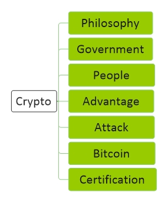

# [Crypto](../index.md) 

[Economy](economy.md) |
[Technology](technology.md) |
[Forex](forex.md) |
[Crypto](crypto.md) |
[Mining](mining.md) |
[Wallet](wallet.md) |
[Techniqual](techniqual.md) |
[Project](project.md) |
[Analysis](analysis.md) |
[Strategy](strategy.md) |
[Execution](execution.md) |
[Data](data.md) |
[Develop](develop.md) |
[Resource](resource.md)

<a href="#Philosophy">Philosophy</a> -
<a href="#bitcoin">Government</a> -
<a href="#people">People</a> -
<a href="#bitcoin">Bitcoin</a> -
<a href="#advantage">Advantage</a> -
<a href="#attack">Attack</a> -
<a href="#certification">Certification</a> -
<a href="#concept">Concept</a> -
<a href="#note">Note</a>

<!-----------------------------------------------------------Philosophy----------------------------------------------------------->

## Philosophy 

<!-----------------------------------------------------------Government----------------------------------------------------------->

## Government 

<!-----------------------------------------------------------People----------------------------------------------------------->

## People

<!-----------------------------------------------------------Bitcoin----------------------------------------------------------->

## Bitcoin

رمزارزها

در ماه اگوست همان سال رکود شدید آمریکا بیتکوین اعلام موجودیت کرد، حداقل از ۲ سال پیش داشته رو برنامش کار میکرده و چه به موقع اعلام موجودیت کرده، آیا این جریان از خود دولت و سیستم آمریکا نیست ؟
اولین TransAction در بلاک 170 اتفاق افتاد

اولین Exchange در بلاک 57043 اتفاق افتادs

ساختار بیتکوین بر پایهٔ سکه است

هش کلید public آدرس بیت کوینی من است

bitcoin progring language(script) based on fort

انگیزهٔ هکر برای سرقت بالاست ولی‌ انگیزی سیستم بانکی‌ برای جلوگیری پایین است، هکر با هوش مصنوعی قویتر میشه
هر ۱۰ دقیقه یک بار یک ثبت یا بلاک در زنجیرهٔ بلاکچین اضافه می‌‌شود

بلاکچین نوعی سیستم برای ثبت اطلاعات، گزارشات و داده‌ها می‌باشد.
اطلاعات ذخیره‌شده روی این نوع سیستم، میان همه اعضای یک شبکه به اشتراک گذاشته می‌شود. با استفاده از رمزنگاری و توزیع داده‌ها، امکان هک، حذف و دستکاری اطلاعات ثبت‌شده، تقریباً از بین می‌رود.

توضیح ساده بیت‌ کوین

وقتی‌ یک محاسبات ریاضی‌ رو به نتیجه میرسونی، اجازه داری یک اسکناس چاپ کنی 
 
بر روی اسکناس یک عدد حک می کنی که مشخص می کند این اسکناس چند تا پول هست
 
مشخص می کنی که این اسکناس را شما چاپ کرده اید
 
این اسکناس اعتبار پیدا خواهد کرد
 
شما صاحب آن خواهی شد

عدد  بر روی اسکناس چگونه مشخص می‌‌شود ؟

روز اول تعیین شد عدد ۵۰ باشد و وقتی‌ ۲۱۰ هزار اسکناس  با این عدد چاپ شد عدد نصف شود(یعنی‌ بشود ۲۵) و دوباره ۲۱۰ هزار اسکناس با عدد جدید (یعنی 25) چاپ شود و همین روند ادامه پیدا کند ...

با این روند چند تا پول تولید خواهد شد ؟

فرض کن یک اسکناس با عدد ۵۰ چاپ کردیم، دفعهٔ بعد یک اسکناس با عدد ۲۵ و دفعهٔ بعد یک اسکناس با عدد ۱۲.۵ و .... همین طور روند رو ادامه بدیم، تا کجا روند ادامه پیدا می کند و در آخر سر چند تا پول تولید خواهد شد ؟

یه فرمول ریاضی می گه :&nbsp;&nbsp;&nbsp;&nbsp;&nbsp;...... + 2a = a + (a/2) + (a/4) + (a/8) + (a/16)

 حالا اگر a=۵۰ در نظر بگیریم و هر بار فقط یک اسکناس چاب کنیم و بعدش عدد را نصف کنیم، اگر همین روند رو پیش بریم در آخر فقط ۱۰۰ تا پول تولید خواهد شد
&nbsp;&nbsp;&nbsp;&nbsp;&nbsp;
........ + (50/16) + (50/8) + (50/4) + (50/2) = 100

 بیت‌ کوین گفته هر بار بعد از اینکه ۲۱۰ هزار تا اسکناس چاپ کردی عدد را نصف کن و عدد جدید را حک کن،پس کل پولی که میتوان تولید کرد (100 * 210/000) است که معادل 21 میلیون خواهد بود

چگونه مشخص می‌‌شود که این اسکناس را من چاپ کرده‌ام ؟

با امضای دیجیتال

آیا می‌‌شود از این اسکناس کپی‌ گرفت؟

aa

آیا میتوان یک اسکناس را دزدید؟

aa

آیا میتوان یک اسکناس را دو بار خرج کرد؟

aa

این اسکناس چگونه بین همهٔ مردم اعتبار پیدا می‌کند؟

با استفاده از تکنولوژی BlockChain

فرض کنید یک ماینر هش درست رو پیدا می‌کند و به اطرافیانش در شبکه اعلام می‌کند و آنها به بلاک خودشان اضافه می کنند، ۵ ثانیه بد یک ماینر دیگه هم هش درست رو پیدا می‌کند و به اطرافیانش در شبکه اعلام می‌کند و آنها نیز به بلاک خودشان اضافه می‌‌کنند حالا اینجا ما ۲ تا بلاک چین داریم، ایم مشکل چی‌ جوری حل می‌شه ؟

ششششش

داستان حمله 51% چیست؟

اگه قدرت تولید بیت کوین دست یک نفر بیوفته، میتونه مثلا 10 بلاک آخر رو قبول نکنه و خودش شروع به ساختنشون بکنه و چون قدرت داره پس طول بلاک چینش بیشتر میشه و همه اون رو قبول میکنن و در نتیجه صاحبان اون 10 بلاک پولشون رو از دست میدهند

اینکه میگن بیت کوین CoinBase هست یعنی‌ چه ؟

نودها همواره بلندترین زنجیره را به عنوان زنجیره صحیح در نظر میگیرند

به صورت قراردادی، اولین تراکنش در یک بلوک، تراکنش خاصی محسوب میشود که سکهی جدیدی را
ایجاد کرده و مالک آن تولیدکنندهی آن بلوک است

تفاوت مقدار خروجی یک تراکنش از مقدار ورودی آن کارمزد تراکنش است

در هر دوره فقط 210 هزار پول تولید خواهد شد

پس از هر دوره که 210 هزار تا پول تولید شد، مبلغ جایزه نصف خواهد شد

<!-----------------------------------------------------------Advantage----------------------------------------------------------->

## Advantage

#### Decentralize

#### Anonymity

#### Security

#### Immutability

#### Capacity

<!-----------------------------------------------------------Attack----------------------------------------------------------->

## Attack

<!---------------------------------------51% / Fork / Double Spending-->
#### 51% / Fork / Double Spending

فرض کنید ما ۵۱ درصد قدرت ماین شبکه رو داشته باشیم، می‌تونیم یه پول بزرگ انتقال بدیم و محصول رو دریافت کنیم و بعدش اون بلاک انتقال پول رو حذف کنیم و از اونجا به بعد رو ماین کنیم، چون قدرت ما از همه بیشتر هست پس ما بیشتر بلاک تولید می‌کنیم و طول بلاک چین ما بیشتر خواهد شد و در نتیجه بلاک چین ما معتبر خواهد بود

<!---------------------------------------Block withholding-->
#### Block withholding

معمولا یک بلاک ۱۰ دقیقه طول می‌‌کشد تا تولید شود، حالا من اگه تو ۳ دقیقه اول به جواب برسم می‌تونم اعلام نکنم که به جواب رسیدم و چند دقیقه رو بلاک بعدی کار کنم و بعدش اعلام کنم، این جوری چند دقیقه از دیگران برای تولید بلاک بعدی جلوتر هستم

<!---------------------------------------Zero Knowledge Proof (ZKP)-->
#### Zero Knowledge Proof (ZKP)

بدون اینکه نشون بدم اثبات کنم صاحب آن چیز هستم

<!---------------------------------------Blacklisting forking-->
#### Blacklisting forking

فرض کنید یه بلاک ساخت شده میاد به نام نیما و ما دوسش نداریم پس بلاک رو قبول نمی‌کنیم و چون قدرت محاسبهٔ بالا داریم خودمون بلاک بعدی رو ماین می‌کنیم و همین طور طول بلاک چین ما بزرگتر میشود پس همه اون رو قبول میکنند

<!---------------------------------------Feather forking-->
#### Feather forking

فرض کنید یه بلاک میاد به نام نیما و ما نمیخوایم قبولش کنیم، یه شاخه دیگه درست می‌کنیم و ماین می‌کنیم، اگر جلو افتادیم که هیچی‌  و به هدفمون رسیدیم ولی‌ اگه جلو نیفتادیم برمیگردیم به همون شاخه اصلی‌ و بی‌خیال میشیم

این باعث می‌شه کسی‌ با نیما معامله نکنه

<!---------------------------------------history version in attack-->
#### history version in attack

<!---------------------------------------Self mining attack-->
#### Self mining attack

<!---------------------------------------merge mining attack-->
#### merge mining attack

<!---------------------------------------Flash Loan-->
#### Flash Loan

<!---------------------------------------Rugpool-->
#### Rugpool

Liquidity stealing | Disable sell function | Developer cash out

<!-----------------------------------------------------------Certification----------------------------------------------------------->

## Certification

EC-Council : Blockchain Certification Course

Udemy : Blockchain For Business 2021

UpGard : P.G. Diploma in Blockchain Technology

101 Blockchains : Certified Enterprise Blockchain Architect

edX : Blockchain technology

Pluralsight : Blockchain Principles and Practices

<!-----------------------------------------------------------Concept----------------------------------------------------------->

## Concept

#### Cross Input Signature Aggregation

aaaa

<!-----------------------------------------------------------Note----------------------------------------------------------->

## Note

لایو رضا نور محمدی در مورد IOT

بررسی قابلیت Extensibility و Bread در  NFT در Etherem در ERC721

بعضی شبکه ها کارمز رو با توکن خودشون میگیرن و میسوزونن و با افزایش تراکنش قیمت توکن میره بالا

  روش کار مکانیزم‌های PoS و DPoS

