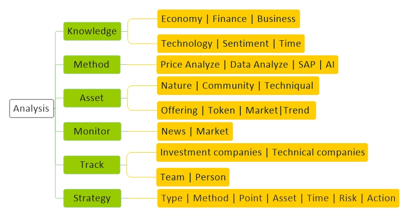

# [Analysis](../index.md) 

[Economy](economy.md) |
[Technology](technology.md) |
[Forex](forex.md) |
[Crypto](crypto.md) |
[Mining](mining.md) |
[Wallet](wallet.md) |
[Techniqual](techniqual.md) |
[Project](project.md) |
[Analysis](analysis.md) |
[Strategy](strategy.md) |
[Execution](execution.md) |
[Data](data.md) |
[Develop](develop.md) |
[Resource](resource.md)

<a href="#concept">Concept</a> -
<a href="#knowledge">Knowledge</a> -
<a href="#method">Method</a> -
<a href="#asset">Asset</a> -
<a href="#monitor">Monitor</a> -
<a href="#investment-companies">Investment</a> -
<a href="#technical-companies">Technical</a> -
<a href="#team">Team</a> -
<a href="#person">Person</a> -
<a href="#note">Note</a>

<!-----------------------------------------------------------Concept----------------------------------------------------------->

## Concept

تارگت پیش بینی قیمت است یعنی تشخیص حرکت قیمت, پس موضوع اصلی ما حرکت است

احساس بازار نسبت به ارزش یک چیز قیمت را مشخص می کند

حرکت نتیجه حجمه و تحرکات است,  حجمه از نظر من (OrderBook) و تحرکات (TradeList) است

تمایل در هر معامله بر اساس اینکه کدام طرف زودتر Order خود را گذاشته است و کدام طرف قبول کرده است مشخص میشود

Histogram : پخش کردن دیتا بر روی صفحه بر اسا مقدارشون 

Distribution : شش 

Quantiles : شششش 

<!-----------------------------------------------------------Knowledge----------------------------------------------------------->

## Knowledge

<!---------------------------------------Economy-->
#### Economy 

 

Smart contract state : stop / kil / pause / transfer / 

اهمیت پروژه‌های لایه پروتکل نسبت به لایه اپلیکیشن

ادررس های فعال یک  پروژه چک شود تا بفهمیم چند نفر بااین پروژه کار می کنند و همچنین موجودیشون

 Activity یکی تعداد تراکنش داریم یکی اینکه چه تعداد آدرس این تراکنش ها رو انجام دادن

پیگیری آدرس نهنگ ها میتونه اطلاعاتی ز روند بازار به ما بده

evm compatible

برو دنبال RBtraje

اگه بتونیم بفهمیم اوراکل ها قیمت هاشونو از کجا میگیرن و ما زودتر از یه جا دیگه بریم بفهمیم میتونیم تو اون پروٰه ها سود کنیم

<!---------------------------------------Finance-->
#### Finance 

 

<!---------------------------------------Business-->
#### Business 

 

<!---------------------------------------Technology-->
#### Technology 

 

<!---------------------------------------Sentiment-->
#### Sentiment 

 

<!---------------------------------------Time-->
#### Time 

<!--Past-->

Past
 

باید بررسی کنیم چه اتفاقاتی در گذشته افتاده است

<!--Now-->

Now
 

باید بفهمیم چه مشکلانی وجود دارد ؟ کیا  دارن حل میکنند ؟ چه جوری دارن حل میکنن؟

<!--Future-->

Future
 

AI | DLT | IOT : آینده از اینجا عبور میکند

دنیا داره به سمت هویت و اعتبار دیجیتالی شبکات اجتماعی و ویرچوال و متاورسی میره

مالکیت گروهی یکی از نیازهای آینده است

<!-----------------------------------------------------------Method----------------------------------------------------------->

## Method

<!---------------------------------------Price action-->
#### Price Analysis

<!---------------------------------------Data Analysis-->
#### Data Analysis

<!---------------------------------------Artificial intelligence-->
#### Artificial intelligence

<!---------------------------------------Statistic and probability-->
#### Statistic and probability

<!-----------------------------------------------------------Asset----------------------------------------------------------->

## Asset

<!---------------------------------------Nature-->
#### Nature 
<!--Short summary-->
Summary 

چقدر شفاف است ؟ بازار هدفش کجاست؟ از کجا آمده است؟ الان کجا هست؟ الان داره چیکار میکنه؟ چه زمانی شروع کرده ؟

<!--Problem-->
Problem 

هدف پروژه چی هست؟ چه مشکلی رو میخواد حل کنه؟ آیا شدنی هست؟ خیالپردازی نیست؟

<!--Use Case-->
Use Case 

دقیقا باید بگه کجا اون مشکل مساله ساز شده که میخواهد حل کند؟

<!--Solution-->
Solution 

به چه روشی قراره مشکل رو حل کنه؟

<!--Architecture-->
Architecture 

اون روش رو قراره با چه معماری پیاده سازی بکنه؟

<!--Application-->
Application 

الان محصولی دارند ؟ کاری کردند ؟ چیزی تو دستشون دارند ؟

<!---------------------------------------Community -->
#### Community   
Founder | Investor | Member | Partnership | Social Media 

بنیان گذاران این پروژه چه کسانی هستند؟
سرمایه گذاران این پروژه چه کسانی هستند؟
اعضای این پروژه چه کسانی هستند؟

 Partnership این پروژه چه کسانی هستند؟
کیا دارن باهاش همکاری میکنند؟
AMM هاش کیا هستند؟

ارتباط Partnership با پروژه چگونه هست؟ آیا ارتباط دو طرفه هست یا فقط یک طرفه؟

سابقه این افراد در چه حدی است؟
چقدر فعالیت دارند؟
چقدر در شبکات اجتماعی شناخته شده هستند؟

Exchange هایی که لیستش کردند کیا هستند؟ 
StableCoin هایی که باهاش کار میکنند کیا هستند؟

Oracle هایی که باهاش کار میکنند کیا هستند؟
این پروژه چقدر شبکات اجتماعی صحبت میشه ؟ کیا در موردش حرف میزنند ؟

<!---------------------------------------Techniqual-->
#### Techniqual 
<!--Technology-->

Technology
 

از چه تکنولوژی هایی استفاده میکنه؟  نحوه اجماع تغییرات چگونه است؟ از نظر قانون و قانون گذاری تو چه شرایطی هست؟

<!--Road map-->

Road map
 

نقشه راه چگونه هست؟  آیا به نقشه راه متعهد بوده؟ اهمیت اعلام نقشه راه توسط یک پروژه در ماه اول سال

<!--Github-->

Github
 

روند آپدیت سورس برنامه چگونه است؟ چند نفر روی سورس کار میکنند؟ اونها کی هستند؟ سابقشون چی بوده؟

<!---------------------------------------Offering-->
#### Offering 

چه IDO هایی که معرفیش کردن؟ - چقدر سرمایه اولیه جذب کرده؟ چه Echange هایی این توکن رو لیست کردند؟

<!---------------------------------------Token-->
#### Token 

استیکینگ دارد یا ندارد؟ کارایی توکن چی هست؟

تعداد توکن چقدر است؟
نرخ تولید چقدر است؟
توکن های تولید شده چقدر است؟
توکن های در چرخه گردش چقدر هست؟

توکن سوزی داری و اگه داری چی جوری؟

<!---------------------------------------Market-->
#### Market 
<!--Potential-->

Potential
 

اون کار چقدر در مارکت پتانسل دارد؟

مثلا الان یکی بیاد بگه من میخوام NFT ها رو تو وثیقه قرار بدم همه استقبال میکنند چون ملت کلی NFT دارن رو دستشون

<!--MarketCap-->

MarketCap
 

ارزش بازارش چقدر است؟

<!--Transaction-->

Transaction
 

چند تا تراکنش دارد ؟
حجم معامله چقدر است؟
هزینه تراکنش چقدر است؟

<!--Customer-->

Customer
 

چند نفر از این دارن ؟
هر کدام چقدر دارن ؟
 آدرس ها چقدر فعال هستند؟
روند تعداد آدرس های جدیدی که ساخته میشوند؟

<!--Same Project-->

Same Project
 

تو هر پروژه قیمت رقیب هاشو ببینید تا بفهمید قیمت واقعی اون پروژه چقدر است

مزیت رقابتی دو پروژه یکسان چی هست؟

<!--Price History-->

Price History
 

دلیل بالا رفتن هاش چی بوده؟ دلیل پایین اومدناش چی بوده؟ با ATH چقدر فاصله داره؟ با قیمت اول چقدر فاصله دارد؟

<!--OnChain data-->

Onchain Data
 

Property | Count | Offer | Request | Price | Market cap | Trade list | Volume | Hold | Cycle | Orderbook

<!---------------------------------------Trend-->
#### Trend 

Infrastructure | Storage  | IOT | AI | Confidentiality

Exchange | Oracle | MarketPlace

‌NFT ها باید یه جا ذخیره بشوند

استیبل کوین هایی که Multi chain هستند و بصورت ذاتی و  بصورت ذاتی و بدون واسطه بر روی چند شبکه هستند > امکانش تو شبکه LUna  هست

همین اتفاق برای صرافی ها چون هزینه تراکنش کاهش پیدا میکند و همچنین سرعت بیشتر میشه و همچنین نقدینگی بیشتری دارند

<!---------------------------------------Other-->
#### Other 

بفهمیم رشد یک پروژه روی رشد چه پروژه هایی تاثییر میگذارد

بررسی پروژه ها بر اساس مقدار توکنی که توش قفل شده

وقتی قوانین سفت و سخت میشه مردم به صرافی های غیر متمرکز رو میآورند و پروژه های Privacy میان بالا

پروژه خوب خودشو در ریزش و برگشت مارکت مشخص میکند

پروژه هایی که در کاهش هزینه کار میکنند آینده دار هستند

توکن هایی که از نظر فنی چیزی ندارن خیلی روی Marketing کار میکنند

اهمیت مختصات جغرافیایی پروژه 

برید ببینید استخرهای ماینینگ کجا میرن

بحث Staking  باید جدی گرفته شود

خبر های Coinbase رو بیشتر از Binance جدی بگیر

توکن هایی که هم در Coinbase و هم در Binance لیست میشه خیلی رشد میکنه

باید حواسمون به ZKP باشع روژه های جدید

پروژه هایی که دیتای بیشتری دارند ارزش بیشتری دارند

مقایسه رشد پروژه ها با شاخص ها مثل بیت کوین

چه جوری بفهمیم یه پروژه ای واقعا کارمیکنه؟

Binance LaunchPad

 هکتون پروژه ها خیلی مهمه که کدام پروژه ها برنده میشن و کدام سرمایه گذار ها روش سرمایه گذاری میکنند و آینده پروژه ها به کدام سمت داره میره

<!---------------------------------------PCITO-->
#### PCITO 
<table align="center"><tbody>
<tr><td colspan="5" align="center" bgcolor="D1ECCF">PCITO Index</td></tr>
<tr><td  align="center">P</td><td  align="center">C</td><td  align="center">T</td><td  align="center">I</td><td  align="center">O</td></tr>
<tr><td  align="center">Product Target</td><td  align="center">Community</td><td  align="center">Technology</td><td  align="center">Incentive</td><td  align="center">Opportunity</td></tr>
</tbody></table>

<!-----------------------------------------------------------Monitor----------------------------------------------------------->

## Monitor

<!---------------------------------------News-->
#### News

Shadows of the news : وقتی یه خبری میشنوید دقت کنید سایه های خبر رو ببینید

Hands behind the curtain : دست های پشت پرده رو در نظر بگیرید

تاثییر خبر دولت ها : اول چین - دوم آمریکا

کشورهایی که دوستدار رمزارز هستند : Japan | Switzerland | Singapore

بیشترین نفوظ کریپتو در ژاپن هست

بانک DBS سنگاپور یه صرافی کریپتویی درست کرده که Bitcoin | Eth | XRP

چین داره یه پلتفرم درست میکنه برای پرداخت های بانک مرکزیش

XRP هی داره دفترشو تغییر میکنه

حجم های معامله Uniswup  از Coinbase zad balatar

سامسونگ داره رو این دست پروژه ها (هویت و اعتبار دیجیتالی شبکات اجتماعی و ویرچوال و متاورسی) سرمایه گذاری میکنه

افزایش تقاضا برای پروژه‌های اوراکل و تاثیر آن بر روی LINK و BAND 

یه شرکت اومده داره همه این Stable coin ها رو در یک شبکه قرار دهد و اگه این بشه بعدش یه شبکه از CBDC ها درست میشه یعنی جای Swift رو میگیره

پروژه ها دارن کمکم میان به سمت شرق

بازار بورس که قانونی است داره به کریپتو نزدیک میشه و این یعنی آینده خوبی از نظر قانونی در انتظار کریپتو است

<!---------------------------------------Market-->
#### Market

<!-----------------------------------------------------------Investment companies----------------------------------------------------------->

## Investment companies

#### A16Z

موسسه سرمایه گذاری در زمینه کریپتو

اندرسن هوروویتز

Data, Privacy, Security Project : Arweave(AR) | Aleo(ALEO)

NFT Project : NEAR Protocol(NEAR) | OpenSea 

#### Coinbase Ventures

موسسه سرمایه گذاری در زمینه کریپتو

Data, Privacy, Security Project : StarkWare

Exchange : some exchange

coinbase روی پروژه هایی داره سرمایه گذاری میکنه که دارن دیتای بلاک چین رو تحلیل میکنند

صرافی CoinBase خیلی قانونی است و اصلا توکن های به درد نخور رو لیست نمیکنه

مجوز SOC2 دارد

#### Pantera Capital

موسسه سرمایه گذاری در زمینه کریپتو

Exchange : FTX US | Balancer (BAL)

Infrastructure : Celer Network (CELR)

Ampleforth(AMPL)

#### Paradigm Capital

موسسه سرمایه گذاری در زمینه کریپتو

Exchange : dYdX (dYdX) | Uniswap (UNI)

Capital market : Compound (COMP)

#### Sequoia Capital

موسسه سرمایه گذاری در زمینه کریپتو

Exchange : 25%

Infrastructure for organize :  

#### MicroStrategy

#### Tesla

#### Square

jack dorsey

HDWallet

#### Galaxy Digital Holdings

#### BitWise

یه صندوق داره به نام ETF که روی پروژه‌های DeFi سرمای گذاری می‌کنه

Aave | Uniswap | Maker | 0X | YFI | UMA | ZRX | LRC | 

#### Coinfound

شرکت سرمایه گذار در ارزهای دیجیتال

Balancer | TRT | Near | polgodayt | raible | Defity | NMR | API3

داره روی DiFi, NFT, StableCoin کار می کند

#### GrayScale

NMR | 

#### Bitcoin Digital Capital

شرکت BitGo را خرید

#### Goldman Sachs

موسسه مالی معتبر در دنیا

شرکت Coin Metrics را خرید

یه ETF جدید درست کرده

#### xxxxx

موسسه سرمایه گذاری در زمینه کریپتو

Project : APN | POKT | HOPR | INSUR | RAZOR

#### Morgan Stanley

موسسه مالی معتبر در دنیا

28000 از بیت کوین GrayScale مال این شرکت است

#### Multicoin Capital

شرکت سرمایه گذاری در Crypto

#### TP ICAP

میگه من میخوام یک پلتفرم درست کنم برای شرکت و سازمانهای بزرگ برای ترید بیت کوین

زمانی میتونه کار کنه که از FCA لندن مجوز بگیرد

#### Wisekey

تو زمینه Cyber Security و AI داره کار می کند

از سال ۲۰۱۸ دارع رو NFT هایی کار میکنه که پشتوانش حویت دیجیتال افراد است

https://www.wisekey.com/

#### Twitter

khanoome riverson > ghablan : Interchain Foundation > Cosmos 

in khanoum important maember of mina protocol

in khanoum to Medium, boode

Target : FTO | Augmented Identity | 

#### Interchain Foundation

Project : Cosmos | Eris Network | Kadena

Department : VDF

#### Bitfarms

#### Animoca Brands

Project : Nway | SandBox | Dapper Labs

Animoca Brands > Dapper Labs > NBA Top Shot (یکی از بزرگترین کللکشن های NFT)

#### Grantthornton

شرکت قانون گذاری و حسابرسی و مالیات

با EOS قرارداد بسته

#### JPMorgan

موسسه مالی شناخته شده در دنیا

اومده رو بستر Corda یه کوین درست کرده به نام JPCoin  که کارش انتقال پول سنگین بین بانکی است

#### Massmutual

شرکت بیمه massmutual  رفته بیتکوین خریده

#### SBI

Investor of : XRP | R3

#### Ripple

<!-----------------------------------------------------------Technical companies----------------------------------------------------------->

## Technical companies

<!---------------------------------------Google-->
####  Google

 در ماه March سال ۲۰۲۲  یه قسمت مجزا در مورد Blockchain راه اندازی کرد

پیشرفته ترین پروژه های هوش مصنوعی و واقعیت مجازی رو گوگل داره میبره جلو

چون گوگل در زمینه Process و Storage تخصص دارد پس روی این جور پروژه ها تاثییر میگذارد

Target : web3 | Metaverse

Project : Hedera | Thetalabs | Dapperlabs

<!---------------------------------------Intel-->
####  Intel

دستگاهای ماینر ساخته : BMZ1 | BMZ2

Project : 

<!---------------------------------------Dapperlabs-->
####  Dapperlabs

Partnership : Google

Project : FLOW | CryptoKitties

<!---------------------------------------Argo-->
####  Argole

قراره دستگاهای BMZ2 از اینتل بخرن

Project : 

<!---------------------------------------Griid-->
####  Griid

قراره دستگاهای BMZ2 از اینتل بخرن

Project : 

<!---------------------------------------Block-->
####  Block

قراره دستگاهای BMZ2 از اینتل بخرن

شرکت جک دورسی

Project : 

<!---------------------------------------Binance-->
####  Binance

در سال 2015 توکن خودشو به نام BNB راه اندازی کزد  در اکوسیستم Ethereum با استاندارد ERC20

در سال 2019 اکوسیستم Binance chain (BC) راه اندازی کزد با استاندارد BEP2

در سال 2020 اکوسیستم Binance smart chain (BSC) راه اندازی کزد که یک Fork از اتریوم هست با استاندارد BEP20

BSC قابلیت Smart Contract را دارد و همچنین EVM Compatible  است

Project : Binance | TrustWallet

<!---------------------------------------Consensus-->
#### Consensus

Type : Techniqual
Subject : Ethereum
Founder : 
Start : 
Rate : 

Tag : 

Techniqual : 

Member : 

Partnership : 

Same : 

Project : Infura

یکی از بزرگترین شرکت هایی که در حوزه اتریوم کار میکند

<!---------------------------------------ConsenSys-->
####  ConsenSys

یکی از بزرگترین شرکت هایی که در حوزه اتریوم کار میکند

<!---------------------------------------IOHK-->
####  IOHK

کارای کاردانو دستشه

IOHK داره همزمان اتریوم کلاسیک رو هم جلو میبره

<!---------------------------------------MoneyGram-->
####  MoneyGram

یک پلتفرم که برای حواله بین دو نفر پول انتقال میداد

ریپل ۹ میلیون دلار به شرکت MoneyGram کمک کرده

تو مزدک لیست شده

<!---------------------------------------TypingDNA-->
####  TypingDNA

روی استایل تایپ آدما کار میکنن برای  تشخیص شخص تایپ کننده

گوگل ۷ میلیون دلار سرمایه داد بهش

یکی از سرمایه گذاراش Lucian Mincu  است که او یکی از بنیانگذارهای Egld  است

<!---------------------------------------Blockstream-->
####  Blockstream

LIQUID + Lightning = میخوان ادغام بشن

Member : Adam Back

<!-----------------------------------------------------------Team----------------------------------------------------------->

## Team

<!---------------------------------------aaaa-->
####  aaaaa

آزمایشگاه تخصصی CIA داره با دانشگاه Mit همکاری میکند در زمینه BlockChain

<!-----------------------------------------------------------Person----------------------------------------------------------->

## Person

<!---------------------------------------Vitalik Buterin-->
####  Vitalik Buterin

<!---------------------------------------Charles Hoskinson-->
####  Charles Hoskinson

سال ۲۰۱۷ از پروژه اتریوم جدا میشود

<!---------------------------------------Andre Cronje-->
####  Andre Cronje

بنیانگذار yearn.economy | Keep3rV1 است

خیلی خیلی خوش فکر است

پشت Fantom است

همکارش anton nell هست

Project : YFI | FMT | SOLID | KEEP | MULTI | BRIBE | 

در تاریخ ۲۰۲۲/۰۳/۰۶ گفتند دیگه نمیخوان رو DeFi کار کنند

روی ۲۱ سرویس و پروژه کار میکنند

<!---------------------------------------Daniel Larimer-->
#### Daniel Larimer

Main Founder of EOS

<!---------------------------------------Jeremy Wood-->
#### Jeremy Wood

تو تیم BitShares بوده کنار Daniel Larimer

سال ۲۰۱۷ از پروژه اتریوم جدا میشود

<!---------------------------------------Gongyong-->
#### Jeremy Wood

<!---------------------------------------Changpeng Zhao-->
#### Changpeng Zhao

Founder of binance

<!---------------------------------------Changpeng Zhao-->
#### Changpeng Zhao

<!---------------------------------------Adam Back-->
#### Adam Back

twitter : @adam3us

<!---------------------------------------Nick Szabo-->
#### Nick Szabo

اصلا میگن ساتوشی همینه چون ۱۰ سال قبل بیت کوین در مورد همه این مسايی صحبت کرده

nakamotoinstitute.org : مقالاتش اینجا پیدا میشه

<!----------------------------------------------------------------------------------[Whale]-->

## Whale

<!---------------------------------------Huobi-->
####  Huobi

<!-----------------------------------------------------------Note----------------------------------------------------------->

## Note

آیا ممکن است همهٔ کشور‌ها تمام پول کلاسیک خود را جمع کنند و به جایش ارز دیجیتال قرار دهند ؟

Witek Radomski 2022 anjomene chi hast ?

smart contract summit 2020 confrance

City Coin

City DAO

پروژه هایی که باید سال ۲۰۲۲ تکلیفشون معلوم بشه : Polkadot | Cardano | Solana | Fantom | Ethereum | XRP

چارت - محاسبه هزینه پامپ قیمت - یعنی با چقدر پول این موومنت قیمت اتفاق افتاده ؟ کی انجام داده؟ در چه تایمی انجام شده است؟

