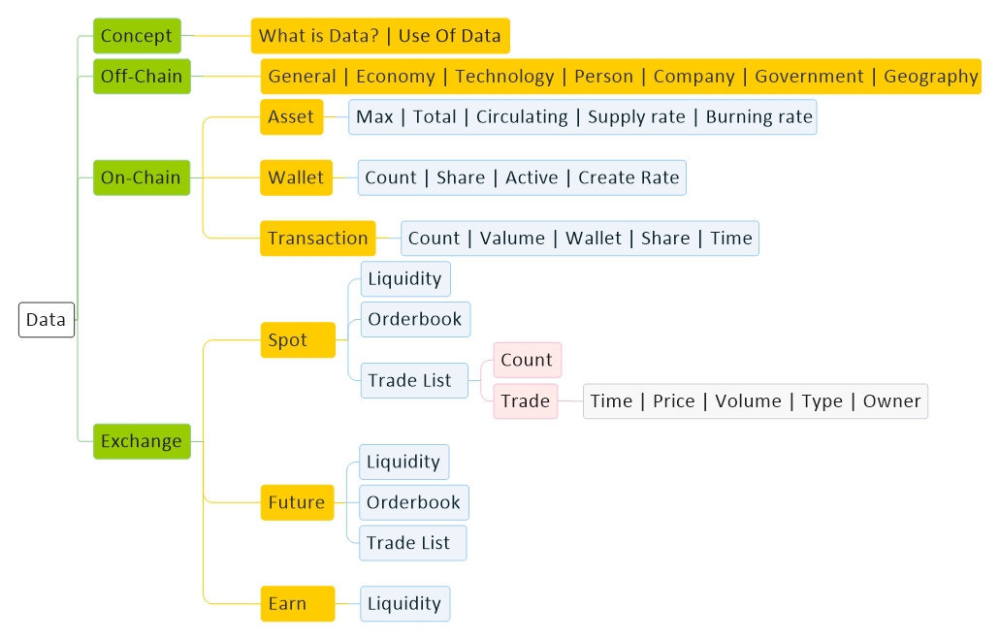
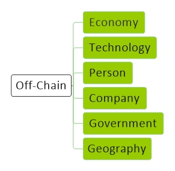
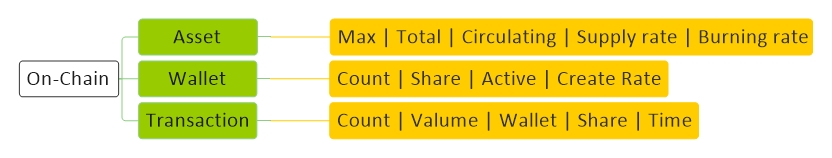
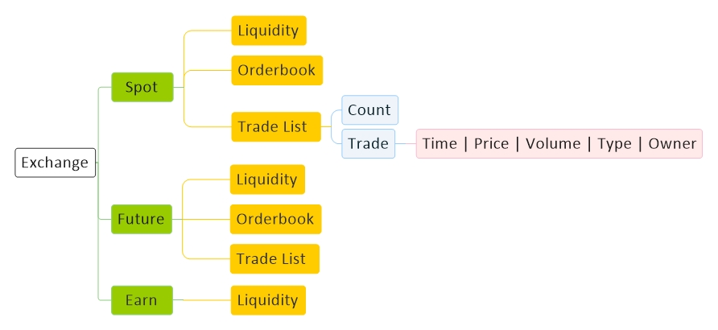

<!----------------------------------------------------------------------------------[CSS]-->

<!----------------------------------------------------------------------------------[Index]-->
# [Data](../index.md) 

<!----------------------------------------------------------------------------------[Pages]-->
[Economy](economy.md) |
[Technology](technology.md) |
[Forex](forex.md) |
[Crypto](crypto.md) |
[Mining](mining.md) |
[Wallet](wallet.md) |
[Techniqual](techniqual.md) |
[Project](project.md) |
[Analysis](analysis.md) |
[Strategy](strategy.md) |
[Execution](execution.md) |
[Data](data.md) |
[Develop](develop.md) |
[Resource](resource.md)

<!----------------------------------------------------------------------------------[Diagram]-->

<!----------------------------------------------------------------------------------[subject]-->
<a href="#concept">Concept</a> -
<a href="#off-chain">OffChain</a> - 
<a href="#on-chain">OnChain</a> -
<a href="#exchange">Exchange</a> -
<a href="#note">Note</a>

<!----------------------------------------------------------------------------------[Concept]]-->

## Concept

<!---------------------------------------What is Data-->
#### What is Data 

هر چیزی اگر در مقام پدر قرار گیرد یک موضوع است و اگر در مقام پسر قرار گیرد یک دیتا است

موضوع فقط خبر میدهد, همین, که مثلا فلان موضوع است

دیتا باعث توصیف موضوع میشود و موضوع را می شناساند و همچنین مقدار دارد

به عنوان مثال اگر (پدر = کشور) و (پسر = مساحت) را نظر میگیریم :

در اینجا کشور یک موضوع است و فقط خبر داده که یه چیزی هست بهش میگن کشور و مقدار ندارد

در اینجا مساحت یک دیتا است که مقدار هم دارد که موضوع(کشور) را توصیف میکند و باعث شناخت موضوع(کشور) میشود و میتوانی بگویی پدر بزرگ است یا کوچک

پس هر چیزی در یک نگاه میتواند موضوع باشد و در نگاهی دیگر دیتا باشد

این نوع نگاه باعث میشود به یک ساختار درست درختی دیتا در هر موضوعی برسیم

<!---------------------------------------Use Of Data-->
#### Use Of Data 

اصلا دیتا (حالا هر چی میخواهد باشد) را برای چه میخواهیم؟

همه چی از این جمله شروع می شود : من میخواهیم با استفاده از دیتا قیمت بیت کوین رو پیش بینی کنیم

پس ما با ۳ مساله روبرو هستیم : &nbsp;
۱-انسان&nbsp;&nbsp;&nbsp;
۲-قیمت&nbsp;&nbsp;&nbsp;
۳-بیت کوین

پس باید اول به این ۲ سوال جواب بدیم :&nbsp;
۱-انسان چیست؟&nbsp;&nbsp;&nbsp;
۲-قیمت چیست؟&nbsp;&nbsp;&nbsp;
۳-بین کوین چیست؟

قیمت با انسان رابطه دارد و اینکه انسان چیست چه نیازهایی دارد و بر اساس چه چیزی برای یک چیز ارزش قایل می شود

بیت کوین هم یک تکنولوژی است و از نگاه تکنولوژی بررسی می شود

در نهایت نوع نگاه انسان به بیت کوین قیمتش را مشخص میکند

<!----------------------------------------------------------------------------------[Off-Chain]-->

## Off-Chain

#### General

Day of the year | Day of the month | day of the week | Time

#### Economy 
#### Technology 
#### Person 
#### Company 
#### Government 
#### Geography 

اطلاعاتی که بیرون شبکه بلاکچین هستند مثل شبکات اجتماعی و سمینارها و اخبار

<!----------------------------------------------------------------------------------[On-Chain]-->

## On-Chain

<!---------------------------------------Asset--> 
#### Asset 

Max | Total | Circulating | Supply rate | Burning rate

<!---------------------------------------Wallet--> 
#### Wallet

Count | Share | Active | Create Rate

<!---------------------------------------Transaction--> 
#### Transaction

Count | Valume | Wallet | Share | Time

اطلاعاتی که داخل شبکه بلاکچین هستند مثل تعداد کوین,  ماکسیموم تعداد کوین, ترنزاکشنها, والت ها

<!----------------------------------------------------------------------------------[Exchange]-->

## Exchange

<!---------------------Spot-->
#### Spot

Liquidity 

Orderbook 

Trade List
<table class="tbl1"><tbody>
<tr>
<td align="center">Subject</td>
<td>Count | Trade</td>
</tr>
<tr>
<td align="center">Trade</td>
<td>Time | Price | Volume | Type | Owner</td>
</tr>
</tbody></table>

<!---------------------Future--> 
#### Future 

Liquidity 

Orderbook 

Trade List

<!---------------------Earn--> 
#### Earn 
Liquidity 

<!----------------------------------------------------------------------------------[Note]-->

## Note

