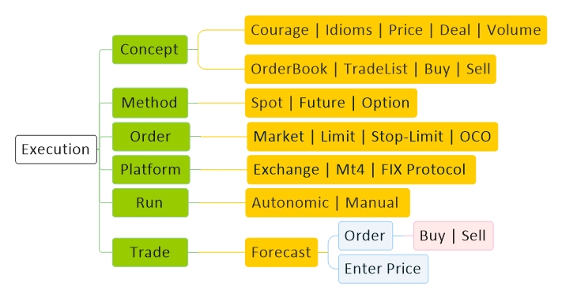
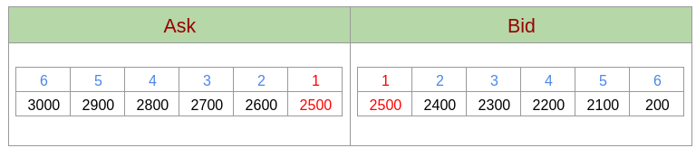
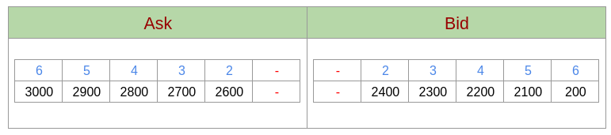
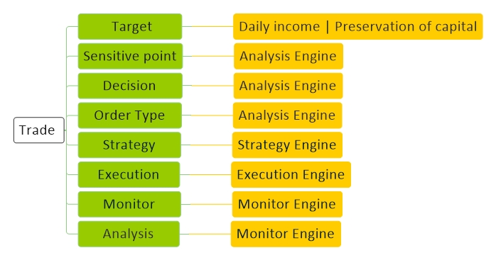

# [Execution](../index.md) 

[Economy](economy.md) |
[Technology](technology.md) |
[Forex](forex.md) |
[Crypto](crypto.md) |
[Mining](mining.md) |
[Wallet](wallet.md) |
[Techniqual](techniqual.md) |
[Project](project.md) |
[Analysis](analysis.md) |
[Strategy](strategy.md) |
[Execution](execution.md) |
[Data](data.md) |
[Develop](develop.md) |
[Resource](resource.md)

 
<a href="#concept">Concept</a> - 
<a href="#method">Method</a> -
<a href="#order">Order</a> -
<a href="#trade">Trade</a> -
<a href="#note">Note</a>

<!-----------------------------------------------------------Concept----------------------------------------------------------->

## Concept

<!--------------------------------------Idioms -->
#### Idioms

    <table align="center"><tbody>
        <tr>
            <td  align="center">Offer</td>
            <td align="center">عرضه</td>
        </tr>
        <tr>
            <td  align="center">Request</td>
            <td align="center">تقاضا</td>
        </tr>
        <tr>
            <td  align="center">Price</td>
            <td align="center">قیمت</td>
        </tr>
        <tr>
            <td  align="center">Volume</td>
            <td align="center">حجم معامله</td>
        </tr>
        <tr>
            <td  align="center">Market Cap</td>
            <td align="center">ارزش  کل بازار</td>
        </tr>
        <tr>
            <td  align="center">Dominance</td>
            <td align="center">تسلط</td>
        </tr>
    </tbody></table>

    <table align="center"><tbody>
        <tr>
            <td  align="center">Bid</td>
            <td align="center">قیمت خریداران</td>
        </tr>
        <tr>
            <td  align="center">Ask</td>
            <td align="center">قیمت فروشندگان</td>
        </tr>
        <tr>
            <td  align="center">Long</td>
            <td align="center">معامله ی خرید</td>
        </tr>
        <tr>
            <td  align="center">Short</td>
            <td align="center">معامله ی فروش</td>
        </tr>
        <tr>
            <td  align="center">Bullish</td>
            <td align="center">بازار صعودی</td>
        </tr>
        <tr>
            <td  align="center">Bearish</td>
            <td align="center">بازار نزولی</td>
        </tr>
    </tbody></table>

    <table align="center"><tbody>
        <tr>
            <td  align="center">Funding</td>
            <td align="center"></td>
        </tr>
        <tr>
            <td  align="center">Leverage</td>
            <td align="center"></td>
        </tr>
        <tr>
            <td  align="center">Pump</td>
            <td align="center">بالا رفتن سریع</td>
        </tr>
        <tr>
            <td  align="center">Dump</td>
            <td align="center">پایین آمدن سریع</td>
        </tr>
        <tr>
            <td  align="center">ATH</td>
            <td align="center">بالاترین قیمت</td>
        </tr>
        <tr>
            <td  align="center">Whale</td>
            <td align="center">نهنگ</td>
        </tr>
        <tr>
            <td  align="center">Hold</td>
            <td align="center">نگه داشتن</td>
        </tr>
        <tr>
            <td  align="center">Fomo</td>
            <td align="center"> ترس</td>
        </tr>
    </tbody></table>

<!---------------------------------------Price-->
#### Price

در واقع ما 1 قیمت نداریم بلکه همیشه ۲ تا قیمت داریم

ASK : وقتی‌ یک نفر می‌خواهد یک چیزی بفرشد, قیمت پیشنهادی فروش  او در لیست Ask  قرار میگیرد.

BID : وقتی‌ یک نفر می‌خواهد یک چیزی بخرد, قیمت پیشنهادی خرید او در لیست Bid  قرار میگیرد.

<!---------------------------------------Deal-->
#### Deal

Buy :  معامله ی خرید همیشه با قیمت Ask انجام میشود.

Sell :  معامله ی فروش همیشه با قیمت Bid انجام میشود.

<!---------------------------------------Orderbook-->
#### Orderbook

معامله یعنی تبدیل

در واقع ما چیزی به نام خرید یا فروش نداریم, معامله یعنی تبدیل, یعنی دو نفر یه چیزی به هم میدهند و یه چیز دیگه از هم میگیرند

تعیین نسبت تبدیل

در معامله همیشه یک طرف راثابت در نظر میکیریم و ارزشش را با طرف دیگر میسنجیم مثلا در BTC/USDT ما BTC را ثابت نگه داشتیم و طرف دوم که USDT هست تغییر میکنه تا متوجه بشیم ارزش BTC چقدر است

معامله چگونه انجام میشود؟

حالا ملت اومدن پیشنهاد های فروششون رو ریختن تو لیست Ask و پیشنهادهای خریدشون رو ریختن تو لیست Bid خب بعدش ....؟

 قیمت های پیشنهادی فروش (Ask) را از کمترین به بیشترین مرتب میکنیم که بهترین فروشنده ها بیان بالا

قیمت های پیشنهادی خرید (Bid) رااز بیشترین به کمترین مرتب میکنیم که بهترین خریدارها بیان بالا

هر وقت قیمت Ask با ‌Bid همسان شد معامله انجام میشود

فرض میکنیم معامله اول انجام شد,  الان چه اتفاقی می افتد؟

چون قیمت Ask با Bid همسان نیست هیچ معامله ای انجام نمیشود و در واقع مارکت از حرکت می ایستد

اگه تو این شرایط یک نفر دکمه Buy رو بزند چه اتفاقی می افتد؟معامله رو با قیمت Ask مارکت(اولین قیمت Ask) انجام میدهد

اگه تو این شرایط یک نفر دکمه Sell رو بزند چه اتفاقی می افتد؟معامله رو با قیمت Bid مارکت(اولین قیمت ‌Bid) انجام میدهد

<!---------------------------------------Trading list-->
#### Trading list

لیست معامله هایی که انجام میشود

<!---------------------------------------Valume-->
#### Valume

حجم معاملات

<!-----------------------------------------------------------Method----------------------------------------------------------->

## Method

<!--------------------------------------Spot -->
#### Spot

۱ - موجودی واقعی شما در این قسمت است و شما صاحب آنها هستید چه ارزشش بشود ۰ چه بشود ۱۰۰۰

۲ - در این جا شما فقط میتوانید به اندازه موجودی خود خرید کنید و فقط چیزی که دارید رو بفروشید 

<!--------------------------------------Margin -->
#### Margin

۱ - میتوان از بایننس قرض گرفت و او از شما کارمزد می گیرد

۲ -چون قرض می دهد میتوان بیشتر خرید کرد و چیزایی که خریدید مال شماست اگر قرض بایننس رو پس بدهید

۳ - چون قرض می دهد میتوان چیز نداشته را قرض گرفت و فروختتش  و بعدا قرض بایننس را داد
 
&nbsp;&nbsp;&nbsp;&nbsp;(میدونی ADA میاد پایین اما نداری - میتونی آدا قرض بگیری و بفروشی و زمانی که آدا اومد پایین آدا بخری و قرضتو پس بدی)

۴ - تا زمانی که قرض بایننس را پس نداده اید شما صاحب مطلق چیزایی که دارید نیستید چون بایننس همش داره چک میکنه با
&nbsp;&nbsp;&nbsp;&nbsp;موجودی که دارید میتونید  قرضشو پس بدید یا نه و به محض اینکه قیمت ها به جایی برسد که شما نتونی قرضش رو پس بدی
&nbsp;&nbsp;&nbsp;&nbsp;بایننس هر چی داری رو میفروشه تا قرض و کارمزدشو ازت بگیره

<!-- ‌Cross -->
‌Cross

حد لیکوییدی موجودی کل حساب مارجین است

<!-- ‌Isolated -->
‌Isolated

حد لیکوییدی موجودی همان مورد معامله است نه کل حساب مارجین

<!--------------------------------------Futures -->
#### Futures

<!-- General -->

Derivatives : به معنی مشتقات، یک سری دارایی‌های مالی هستند که ارزش آنها بر اساس یک یا چند دارایی دیگر تعیین می‌شود

Futures : قراردادهایی بین دو طرف هستند که درطی آن یک دارایی مشخص با قیمتی که طرفین قرارداد بر سر آن به توافق رسیده‌اند، در تاریخی معین معامله می‌شود

این چیزی که اینجا هست اسمش فیوچر هست اما فرق داره یه چیز من درآوردیه

در واقع چیزی نمیخری که دستت باشه روی بالا رفتن یا پایین آمدن قیمتش شرط بندی میکنی

بهت Leverage میدهد و میتونی روی حجم بیشتری قمار کنی

USD(S)-M Futures : ارز پایه یک Stable coin است, حرف S مخفف Stable Coin است

Coin-M Futures : ارز پایه یک Coin است

Prepetual : قراردادهایی بدون تاریخ سررسید 

Quarterly : قراردادهایی با تاریخ سررسید

Mark Price : صرافی‌ها برای جلوگیری از دستکاری‌های احتمالی با استفاده از فرمولی خاص این قیمت را به دست می‌آورند، سود و ضرر و لیکوئید شدن کاربران با این قیمت محاسبه می‌شود

Index Price : به قیمت کوین در بازار اسپات یا نقدی اشاره دارد، قیمت در قراردادهای آتی بر اساس این قیمت تعیین می‌شود

<!-- Funding -->
Funding

برای نزدیک شدن قیمت بازار نقدی یا اسپات با قیمت معاملات فیوچر از این سیستم استفاده میکنند

در حالت صعودی این عدد مثبت است و باید به اندازه درصد این عدد از حجم معامله توسط خریدار ها به فروشنده ها پرداخت شود

در حالت نزولی این عدد منفی است و باید به اندازه درصد این عدد از حجم معامله توسط فروشنده ها به خریدار ها پرداخت شود

Countdown : هر ۸ ساعت یکبار اتفاق می افتد

<!-----------------------------------------------------------Order----------------------------------------------------------->

## Order

‌Cross : حد لیکوییدی موجودی کل حساب موردنظر(Future | Margin)است

‌Isolated : حد لیکوییدی موجودی همان مورد معامله است نه کل حساب موردنظر(Future | Margin)

<!--------------------------------------Buy -->
#### Buy

<!----------Market-->

Market

تمام حجم معامله رو به ترتیب از اولین قیمت Ask (قیمت پیشنهادی فروشندگان) شروع به خرید می کند و برایش مهم نیست با چه قیمت هایی می خرد 

<!----------Limit-->

Limit

اگر Price که من مشخص کرده ام بالا تر یا مساوی قیمت بازار بود بخر  
اگر Price که من مشخص کرده ام پایین تر از قیمت بازار بود, در صورتی که قیمت بازار بهش رسید بخر

<!----------Stop-Limit-->

Stop-Limit

اگر قیمت بازار به عدد Stop رسید معامله را فعال کُن و بعد از فعال شدن معامله :  
اگر Price که من مشخص کرده ام بالا تر یا مساوی قیمت بازار بود بخر  
اگر Price که من مشخص کرده ام پایین تر از قیمت بازار بود, در صورتی که قیمت بازار بهش رسید بخر

<!----------OCO-->

OCO

اگر Price که من مشخص کرده ام بالا تر یا مساوی قیمت بازار بود بخر  
اگر Price که من مشخص کرده ام پایین تر از قیمت بازار بود, در صورتی که قیمت بازار بهش رسید بخر

اگر قیمت بازار به عدد Stop رسید معامله را فعال کُن و بعد از فعال شدن معامله :  
اگر Price که من مشخص کرده ام بالا تر یا مساوی قیمت بازار بود بخر  
اگر Price که من مشخص کرده ام پایین تر از قیمت بازار بود, در صورتی که قیمت بازار بهش رسید بخر

هر معامله ای که زودتر انجام شود دیگری را کنسل می کند

<!--------------------------------------Sell -->
#### Sell

<!----------Market-->

Market

تمام حجم معامله رو به ترتیب از اولین قیمت Bid (قیمت پیشنهادی خریداران) شروع به فروش می کند و برایش مهم نیست با چه قیمت هایی می فروشد 

<!----------Limit-->

Limit

اگر Price که من مشخص کرده ام پایین تر یا مساوی قیمت بازار بود بفروش  
اگر Price که من مشخص کرده ام بالاتر از قیمت بازار بود, در صورتی که قیمت بازار بهش رسید بفروش

<!----------Stop-Limit-->

Stop-Limit

اگر قیمت بازار به عدد Stop رسید معامله را فعال کُن و بعد از فعال شدن معامله :  
اگر Limit که من مشخص کرده ام پایین تر یا مساوی قیمت بازار بود بفروش  
اگر Limit که من مشخص کرده ام بالاتر از قیمت بازار بود, در صورتی که قیمت بازار بهش رسید بفروش

<!----------OCO-->

OCO

اگر Price که من مشخص کرده ام پایین تر یا مساوی قیمت بازار بود بفروش  
اگر Price که من مشخص کرده ام بالاتر از قیمت بازار بود, در صورتی که قیمت بازار بهش رسید بفروش 

اگر قیمت بازار به عدد Stop رسید معامله را فعال کُن و بعد از فعال شدن معامله :  
اگر Limit که من مشخص کرده ام پایین تر یا مساوی قیمت بازار بود بفروش  
اگر Limit که من مشخص کرده ام بالاتر از قیمت بازار بود, در صورتی که قیمت بازار بهش رسید بفروش

هر معامله ای که زودتر انجام شود دیگری را کنسل می کند

<!-----------------------------------------------------------Trade----------------------------------------------------------->

## Trade

مشخص نمودن درآمد از ترید ها که منجر به جلوگیری از طمع بشود

مفهوم خط حساس

مفهوم محاسبه توان حرکت

مفهوم توان حد ضرر و سود

انتخاب لورژ مناسب

واکنش بازار نسبت بر ترند هایی که میگن

بررسی جون بازار

قاطی نکردن تحلیل ها و پوزیشن های لانگ و میدل و شورت

مفهوم ذخیره سود

عوض نشدن جای حرکت اندازه به جای حجم معامله برای سود بیشتر

انتظار درست از حد سود یک ترید نه انتظار کلی سود مورد نظر از یک ترید

حرکت در مسیر روند

بررسی نشانه های تغییر روند

مشخص نمودن حد ضرر در استیت های مختلف از جمله فدرال ریزرو

 حد ضرر های پله ای برای پوزیشن های برعکس

اعتبار سنجی لحظه ایه پوزیشن ها

بحث ارزش و اعتبار کندل ها از طرق والیوم و نعداد ترنزاکشن و سایز ترنزاکشن

بحث جسارت

<!-----------------------------------------------------------Note----------------------------------------------------------->

## Note

چرا قیمت Future با قیمت spot متفاوت است؟

Market Price  چیست ؟

Index Price  چیست ؟

چرا قیمت Quarterly با قیمت Prepetual متفاوت است؟

بایننس چگونه چارت جفا ارز مثلا BTC/ETH رو تولید میکند؟

استیبل کوین های الگوریتمی چگونه کار میکنند؟

داستان تاریخ انقضا Quarterly در فیوچر چیست؟

آیا USD همانند USDT یک اسمارت کانترکت است؟

آیا  OrderBook اسپات با فیوچر متفاوت است؟

#### Binance Future

چه لورژهایی میدهد ؟ 

آیا میزان لورژها برای همه کوین ها مساوی است ؟

آیا مقدار لورژ که به من میدهد با مقدار پولی که من در فیوچر بردم ارتباط دارد؟

آیا بابت لورژ از من پول میگیرد ؟

مبحث کامیشن  چگونه است ؟

در یک معامله چه پولهایی به بهانه های مختلف از من میگیرد؟

اگر ۱خخ ببرم در فیوچر و یک ترید باز کنم آیا میتواند تا -۱۰۰۰ هم بیاید ؟

اطلاعات از قبیل مارکت کپ و حجم ورا از کجا میتوان مشاهده کرد ؟

آیا درست است که میگویند سود و ضرر با قیمت مارکت محاسبه میشود ؟

