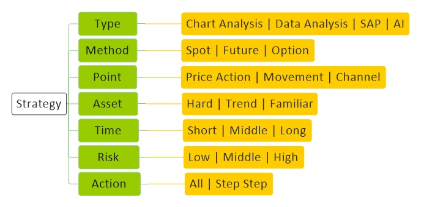

# [Strategy](../index.md) 

[Economy](economy.md) |
[Technology](technology.md) |
[Forex](forex.md) |
[Crypto](crypto.md) |
[Mining](mining.md) |
[Wallet](wallet.md) |
[Techniqual](techniqual.md) |
[Project](project.md) |
[Analysis](analysis.md) |
[Strategy](strategy.md) |
[Execution](execution.md) |
[Data](data.md) |
[Develop](develop.md) |
[Resource](resource.md)

<a href="#concept">Concept</a> -
<a href="#type">Type</a> -
<a href="#method">Method</a> -
<a href="#point">Point</a> -
<a href="#asset">Asset</a> -
<a href="#time">Time</a> -
<a href="#risk">Risk</a> -
<a href="#action">Action</a> -
<a href="#note">Note</a>

<!------------------------------------------------------------------- [ Type ]-->

## Type

Chart Analysis | Data Analysis | SAP | AI

<!------------------------------------------------------------------- [ Method ]-->

## Method

Spot | Future | Option | 

<!------------------------------------------------------------------- [ Point ]-->

## Point

Price Action | Movement | Channel 

<!------------------------------------------------------------------- [ Asset ]-->

## Asset

Hard | Trend | Familiar 

<!------------------------------------------------------------------- [ Time ]-->

## Time

Short | Middle | Long

<!------------------------------------------------------------------- [ Risk ]-->

## Risk

Low | Middle | High

<!------------------------------------------------------------------- [ Action ]-->

## Action 

All | Step Step

<!------------------------------------------------------------------- [ Note ]-->

## Note

آیا ممکن است همهٔ کشور‌ها تمام پول کلاسیک خود را جمع کنند و به جایش ارز دیجیتال قرار دهند ؟

Witek Radomski 2022 anjomene chi hast ?

smart contract summit 2020 confrance

City Coin

City DAO

پروژه هایی که باید سال ۲۰۲۲ تکلیفشون معلوم بشه : Polkadot | Cardano | Solana | Fantom | Ethereum | XRP

اینکخ به سود رسید یا به ضرر /لن بعدی چیه؟ شاید اونجا جسارت میخوایم

