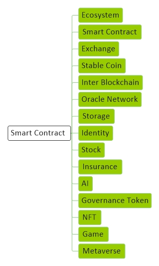

# [Techniqual](../index.md)

[Economy](economy.md) |
[Technology](technology.md) |
[Forex](forex.md) |
[Crypto](crypto.md) |
[Mining](mining.md) |
[Wallet](wallet.md) |
[Techniqual](techniqual.md) |
[Project](project.md) |
[Analysis](analysis.md) |
[Strategy](strategy.md) |
[Execution](execution.md) |
[Data](data.md) |
[Develop](develop.md) |
[Resource](resource.md)

<a href="#diagram">Diagram</a> -
<a href="#ecosystem">Ecosystem</a> -
<a href="#smart-contract-1">Smart Contract</a> -
<a href="#exchange">Exchange</a> -
<a href="#stable-coin">Stable Coin</a> -
<a href="#ido">IDO</a> -
<a href="#oracle-network">Oracle Network</a> -
<a href="#inter-blockchain">Inter Blockchain</a> -
<a href="#nft">NFT</a> -
<a href="#identity">Identity</a> -
<a href="#storage">Storage</a> -
<a href="#insurance">Insurance</a> -
<a href="#stock">Stock</a> -
<a href="#game">Game</a> - 
<a href="#metaverse">Metaverse</a>

<!-----------------------------------------------------------Ecosystem----------------------------------------------------------->

## Ecosystem

<!-----------------------------------------------------------Smart Contract----------------------------------------------------------->

## Smart Contract

قراردادهای هوشمند، قراردادهایی هستند که در صورت برآورده شدن شرایط به طور خودکار در یک چارچوب If/Then اجرا می شوند.

از آنجایی که قراردادهای هوشمند بر روی بلاکچین قرار دارند، تغییر ناپذیر و قابل اثبات هستند.

این قراردادها احتیاج به اطلاعات واقعی دنیا دارند (off-chain)

اهمیت حجم نقدینگی در پروژه‌های دیفای

dap : Clover economy (CLV)| PolkaFoundry (PKF) | Plasm Network (PLM) | Moonbeam (CLMR)

##### Liquidity problem

یکی از مشکلات اصلی پروژه های DeFi نقدینگی است

یک مشکل اینه که Liquidity میره تو پروژه DeFi قفل میشه و دومی اینه که اگه پولتو بخوای میگن برو بعدا بیا

راه حلی که داره میاد Liquide Staking است

Bridge زدن بین Blockchain ها که باعث میشه دارایی های بین شبکه های مختلف به اشتراک گذاشته شود

Fantom > Synthetic Asset > F-Asset نسبتی از پولی که قفل کردی رو بهت F-Asset میدمه که داخل شبکه بتونی خرج کنی

layer2 baes mishe karmozd va fee kam mishe , speed mire bala ,

stable coin > help > Yield generation

    برای اینکه استیبل کوین بسازن مجبور شدن پای بانک رو کشیدن وسط
    دی فای : اقتصاد غیر متمرکز

    وام دهی
    صرافی.
    استیبل کوین
    بیزینس مدل
    ب ارهای مشتقات اتی بیمه
    بستر دیفای قراردادهای هوشمند است
    Blackstack  زیر ساخت قرارداد هوشمند
    پروژه هایی کا کارمزد نمیگیرن آینده دارن
    با رشددیفای اوراکل میره بالا
    پروژه هایی انتخاب کنین گه واقعا هدف داشته باشن

    Defi
    -----------
    تو اتریوم هر بار که اجرا میشه یه مقدار گس مصرف میکنه
    Yam Hack shodbshod 0

    Ether risk baraye parvazhaie havapeimaii
    ضمانت تاخییر پروازهای هوایی

<!-----------------------------------------------------------Exchange----------------------------------------------------------->

## Exchange

Front-Running : حمله به صرافی های غیر متمرکز : ماینر از Order خبر داره و قبلش میره اپن توکن رو میخره یا میفروشه

njective(INJ) : یک پروتکل است که اومده با Trade Execution Coordinator (TEC) اوردرها رو بر اساس زمان و قیمت اولویت بندی میکند

0X(ZRX) : یک پروتکل است که اومده با Verifiable Delay Functions (VDF) اوردرها رو یه تاخییر زمان میدهد

Batch Processing : پنج دقیقه برای اونایی که میخوان بفروشن : پانزده دقیقه برای کسانی که میخوان بخرن : میانگین خرید رو در میارن و میانگین فروش رو در میارن و قیمت مشخص میشه و همه بر اساس اون قیمت معامله میکنند : به صرافی هایی که بر این اساس کار می کنند میگویند Fair DEX

<!-----------------------------------------------------------Stable Coin----------------------------------------------------------->

## Stable Coin

اوراکل ها اطلاعات را از بیرون به داخل شبکه بلاک چین میآورند
اوراکل ها زمانی رشد کردن که DeFi ها شروع به کار کردند
مثلا پلتفرم های وام دهی باید بفهمه الان قیمت مثلا بیت کوین چقدر است

 
    [Economy](economy.md) | وثیقه

    Bayad poshtvane bezaram ta stable bemoone
    Fiat : usdt  
    crypto : die 
    Bedone poshtvane : 
    Kala : petri naft venezouela

    بلاک چین هدفش غیر متمرکز بودن است اما USDT متمرکز است
    Dai سوخت DeFi است و اگه مارکت کپش رفت بالا بپرید توش
    دای بر اساس ارزهای دیجیتال است که همش قیمتش در حال است
    برو از توکنی استفاده کن که پشتوانش دلار نباشه یورو باشه پوند باشه یوان باشه
    از die/usdc در coinbaseمیتونی سود میگیری

    Balaner
    کارش مارکت میکینگ هست 
    میان تو بازار ارزها رو خرید فروش میکنن که قیمتش نیاد پایین
    کریپتو لندینگ از یه جا وام میگیری قسط یه جا دیگه رو میدی و اون وسط یه چیزی واسط میمونه

    ارزهای cbdc ارزهای دولتی مثل ریپل و استلار

    هدف ریپل : تعاملات بین بانکی که تا الان چیزی انجام نشده
    چون قانون هنوز به اون جا نرسیده
    روزی که ریپل مشکل قانونیش حل بشه اولین پروژه ایی که میترکه ریپل هست  جایگزین سویفت قرارهربشه

    یادگیری هزینه نیست بلکه سرمایه گذاری است 

    Pax نهاد مالی آمریکا تایید کرده و اونجایی که باید با بانک ها ارتباط برقرار کنیم به درد میخوره 

    Voice eos ، سوشال مدیا تارگت زمان ما 

<!-----------------------------------------------------------Inter Blockchain----------------------------------------------------------->

## Inter Blockchain

Blockchain swift : Interblockchain  Token : ATOM, BLZ, Dot

حوزه جدید پروژه های DeFi  است

پولت رو میتوانی در چندین پروژه بزاری

به پروژه های IBC مرتبط خواهد شد

Cross-Chain Collateral : وثیقه ی بین زنجیره ای

مفهوم استاندارد XCMP (Cross-Chain Message Passing) که enjin  داره میده بیرون 

<!-----------------------------------------------------------Oracle Network----------------------------------------------------------->

## Oracle Network

انتقال اطلاعات از بیرون به داخل BlockChain

یک شبکه غیر متمرکز از نود هاست که داده‌ها و اطلاعاتی را از منابع off-blockchain به قراردادهای هوشمند on-blockchain از طریق اوراکل فراهم می‌کنند

این پروسه زمانی که یک قرداد هوشمند به داده نیاز دارد، بر روی قرار داد هوشمند شروع می‌شود. در این موقع Smart contract درخواستی را برای اطلاعات ارسال می‌کند.

Uma , Band, Dia

اوراکل ها قرار است proof of reserve انجام بدن مثلا آیا پشت تتر دلار وجود دارد یا نه

DON (Decentralized Oracle Networks) : شبکه های غیر متمرکز اوراکل

Transparency | Governance(Resource / Methodology / Change) | Delay | licence | Data validate

کدام اوراکل Cross-Chain است

 تا زمانی که اوراکل ها نباشن دیفای ها نمیتونن کار کنن

<!-----------------------------------------------------------Storage----------------------------------------------------------->

## Storage

ذخیره اطلاعات بصورت غیر متمرکز

با رشد NFT این پروژه ها هم رشد میکنن چون باید بتونی NFT رو یه جا ذخیره کنی

<!-----------------------------------------------------------Identity----------------------------------------------------------->

## Identity

هویت دیجیتال

رابطه NFTها با ژنوم انسان‌ها و ارتباط آن با احراز هویت دیجیتال 

Protocol : uPort | Azure BaaS | Sidetree | Hyperledger Indy | 

<!-----------------------------------------------------------Stock----------------------------------------------------------->

## Stock

<!-----------------------------------------------------------Insurance----------------------------------------------------------->

## Insurance

<!-----------------------------------------------------------Governance Token----------------------------------------------------------->

## Governance

ارتباط توکن‌های Governance با قانون‌گذاری 

<!-----------------------------------------------------------AI----------------------------------------------------------->

## AI

ارتباط توکن‌های Governance با قانون‌گذاری 

Ai
__________
Oceam platform zalhire va foroahe data
Snom 
Atoz
Gnt platform mohasebate toziie shode
Fetchai
Fet : deepmind
قرهرداد های هوشمند هوشمند
ترکیب بلاک چین و تنگل
حوزه حمل و نقل کار میکند 
تو بحث انرژی و استیل کار میکنند 
/////////////////////

Eip اینجا میرن در مورد شبکه تصمیم گیری میکنند
اتریوم تو 

 پرایویسی کوین
 ‏زیکش
 ‏دش
 ‏مونرو 
 ‏زیرو کوین
Bank of tron کلاه برداری است

Yfi
 Governance token
 ‏میره میگرده ببینه کجا پولتو بزاری سود بیشتری میگیری
 ‏نخرید ارزش نداره استخراجش کنید
 توکنهایی که برای مدیریت یک پروژه تعریف میشن
 ‏comp / smx / mkr / 
Dao

Crv
صرافی غیر متمرکز و فقط استیبل کوین ها رو تبدیل کنی

فدرال ریورز بوستن رفته با mit همکار بشکه که دیجیتال دلار رو بزنن
Privat block chain
Chrom / hyper legend / corda 
توکن های حوزه بانکداری xrp stellar

 پروژه هایی که کارمز صفر دارن خیلی مهمه برای میکرو پیمنت ها

<!-----------------------------------------------------------NFT----------------------------------------------------------->

## NFT

استفاده صنعت مد از کاربردهای NFT 

ثبت اختراعات در قالب NFT 

تحلیل خبر اضافه شدن NFT به تلویزیون‌های سامسونگ

کاربردهای nft : کلکسیون بازی و بلیط

میتونی یه دارایی مثل تابلو رو NFT کنی و بیای با nft وثیقه بشی و وام بگیری

future :
identity oracle 
cross chain

nft protocol : project : change nft mikone

zkp : بدون اینکه از خودت اطلاعات بدی بتونی ثابت منی

<!--Resource-->
#### Resource

Assessment : 
<a target="_blank" href="https://dappradar.com/">dappradar</a> -
<a target="_blank" href="https://rarity.tools/">rarity</a> -
<a target="_blank" href="https://etherscan.io/">etherscan</a> -
<a target="_blank" href="https://icy.tools/">icy</a> -
<a target="_blank" href="https://moby.gg/">moby</a> -
<a target="_blank" href="https://traitsniper.com/">traitsniper</a> -
<a target="_blank" href="https://raritysniffer.com/">raritysniffer</a>

collecribles tokens
sports NFTs
game NFTs
art NFTs
utility NFTs

#### Resiurce

<a target="_blank" href="https://dappradar.com/">dappradar</a>

<table align="center" dir="rtl"><tbody>
<tr><td colspan="2" align="center" bgcolor="D1ECCF">Idiom</td></tr>
<tr><td align="center">Rarity</td><td>شاخص کمیاب بودن</td></tr>
<tr><td align="center">NFT</td><td>Non Fungible Token</td></tr>
<tr><td align="center">aaaa</td><td>aaaaa</td></tr>
<tr><td align="center">aaaa</td><td>aaaaa</td></tr>
<tr><td align="center">aaaa</td><td>aaaaa</td></tr>
<tr><td align="center">aaaa</td><td>aaaaa</td></tr>
<tr><td align="center">aaaa</td><td>aaaaa</td></tr>
<tr><td align="center">aaaa</td><td>aaaaa</td></tr>
<tr><td align="center">aaaa</td><td>aaaaa</td></tr>
</tbody></table>

Community, Utility, Liquidity

یعنی توکن هایی که با هم فرق دارند

یعنی نمیتونی اینا رو با هم تبدیل یا جمع بکنی

انگار کیفیت رو در نظر میگیرد

در صنعت بازی خیلی کاربرد دارد

ERC721 استاندارد NFT های شبکه اتریوم است

ERC1155 استاندارد NFT  برای enjin های شبکه اتریوم است

اکوسیستم NFT : تعریف | نگهداری | ارزش گذاری | مبادله | حراج

روی ۲ شبکه میتونی NFT تعریف کنی : Ethereum (ETH) / Flow (FLOW) / BakerySwap

FNFT : توکن های NFT که قابل تقسیم شدن هستند

DNFT () : یک گروهی مالک NFT هستند

NFT ها به Oracle Network ها به شدت نیازمند هستند

پروژه های بیمه ای

DNA NFT

PFP NFT

مهاجرت NFTها به لایه دوم

مفاهیم  و Dynamic NFT

Event Base NFT : Dynamic NFT : که بر اساس وقایع تغییر میکنند : نیاز به اطلاعات بیرون دارن : اوراکل ها بهشون میدن

NFT  که نماینده عملکرد یک بازیکن بشود

RailLink

NFT Lending platforms : NFTfi

NFT Farming : ان اف تی  هامو میزارم داخل یه استخری بعد یه پاداشی به من میده و هر چی زمان میگذره اون پاداشه ارزش پیدا میکنه و بعد میتونم تبدیلش کنم به همون NFT که گذاشتم

اهمیت خواندن متادیتا در حوزه NFT

اهمیت Community در فضای NFT

Primary Market : اولین باری که فروخته میشود

Secondary Market : حالت دست دوم که بارها فروش رفته پس بهتره چون پتانسیل حتما داشته یعنی نقدشوندگی داره

group : Collection | Sport | Game(kam arzesh tar on Secondary Market) | Metaverse | Art (80% on Secondary Market)

NFT Flipper  : یه NFT میخره و یک هفته دیگه میفروشه و فقط دنبال سود هستند

Underprice NFT :

Community (owner) / develop | utility | team | roadmap

nft  onchain   kheili behtare 

chand ta trader dare / hajme moamele / raftare foroshnade ? key kharide ? chand kharide?

#### NFT Metadata

مثلا یه عکس رو میزاری تو IPFS و یک شناسه میگیری و با این شناسه یک توکن Mint میکنی این شناسه(Metadata) داخل توکن تو هست انگار کلید NFT هست و هرکی NFT رو بخره کلید رو داره و هر کی کلید رو داره اون عکس رو دارد

چی جوری میشه دیتای metadata  رو خومد و زودتر فهمید کدام NFT رو بخریم

#### Lazy Minting

میگه من الان پول ندارم ولی تو ان اف تی من رو مینت کن  و من زمانی که من فروختم پول تورو میدم

Supprt : Foundation | Rarible | OpenSea

<!-----------------------------------------------------------Game----------------------------------------------------------->

## Game

IGO : Initial Game Offering

IAO : Initial Asset Offering

Launchpad : CDEFI | GameFi | Enjinstarter

Investor :
<a target="_blank" href="https://www.dapperlabs.com/">dapperlabs</a> -
<a target="_blank" href="https://www.1confirmation.com/">1confirmation</a> -
<a target="_blank" href="https://polychain.capital/">Coin3polychain60</a>

In-Game Asset : داراهایی که داخل بازی ایجاد میشه

BlockChain : هر چی بلاکچین غیر متمرکزتر بهتر مثل Flow | Wax

L2 : پروژه های لایه دوم مثل Optimism | Polygon | Immutable

Infrastructure : Dapperlabs | Enjin | Ronin

Development Studio : Sky Movies

Marketplace : EnjinX | Rarible

Game : 

Asset : 

PVE : Player versus environment 

PVP : Player versus Player 

<!-----------------------------------------------------------Metaverse----------------------------------------------------------->

## Metaverse

#### Layer 

Social Media 3D

Experience : همون چیری که میریم بازی میکنیم یا داخل شبکات اجتماعی میریم

Created Economy : کسانی که ادوات و بازی ها و توکن ها را تولید میکنند

Special Computing  : محاسبات سه بعدی و توان پردازشی

Hardware :  

Infrastructure : AWS | 

