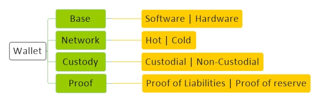

# [Wallet](../index.md) 

[Economy](economy.md) |
[Technology](technology.md) |
[Forex](forex.md) |
[Crypto](crypto.md) |
[Mining](mining.md) |
[Wallet](wallet.md) |
[Techniqual](techniqual.md) |
[Project](project.md) |
[Analysis](analysis.md) |
[Strategy](strategy.md) |
[Execution](execution.md) |
[Data](data.md) |
[Develop](develop.md) |
[Resource](resource.md)

<a href="#diagram">Diagram</a> - 
<a href="#concept">Concept</a> -
<a href="#type">Type</a> -
<a href="#proof">Proof</a> -
<a href="#wallet-1">Wallet</a> - 
<a href="#note">Note</a>

<!-----------------------------------------------------------Concept----------------------------------------------------------->

## Concept

۱ - کیف پول در واقع یک جفت کلید است که میتونی باهاش اطلاعات رو رمز کنی  و همچنین امضا کنی

۲ - وقتی یکی میخواد به شما پول بده میره تو بلاک چین مینویسه این مقدار پول برای این آدرس (کلید عمومی جفت کلید شما) است

۳ - وقتی شما میخوای به یکی پول بدی باید بری تو بلاک چین بنویسی اینقدر پول مال فلانیه و نوشته خودت را امضا کنی که همه بفهمن خودت نوشتی که این کار با (کلید خصوصی جفت کلید شما) انجام میشود 

۴ - مردم چون (کلید عمومی جفت کلید شما) دارند و همچنین امضا رو دارن پس میتونن بررسی کنن این امضا با این آدرس عمومی مطابقت دارد یا نه و اگه مطابقت داشته باشه یعنی این جمله اعتبار دارد چون کسی میتونه امضا کنه که کلید خصوصی جفت ارز رو داشته باشه

<!-----------------------------------------------------------Type----------------------------------------------------------->

## Type

<!--------------------------------------Custodial Wallet-->
#### Custodial Wallet

کیف پول هایی که Private-Key رو پیش خودشون نگه میدارن و به شما نمیدن

<!--------------------------------------Non-Custodial Wallet-->
#### Non-Custodial Wallet

کیف پول هایی که Private-Key رو پیش خودشون نگه نمیدارن و در اختیار شما قرار میدهند

Trust Wallet | Atomic Wallet

<!--------------------------------------Hot Wallet-->
#### Hot Wallet

کیف پول های نرم افزاری که همیشه روی یک سرور هستند و در معرض اینترنت هستند

Project : Project : Trust Wallet | Metamask | Exodus | Atomic Wallet | Coinomi | Myetherwallet | Bluewallet | Math Wallet

<!--------------------------------------Cold Wallet-->
#### Cold Wallet

کیف پول های سخت افزاری که در معرض اینترنت نیستند

Paper Wallet : BitAdress

Hardware Wallet : Ledger, Trezor hd wallet

<!-----------------------------------------------------------Proof----------------------------------------------------------->

## Proof

<!--------------------------------------Proof of Liabilities-->
#### Proof of Liabilities

از کجا بفهمیم چه قدر پول از مشتریها در اختیار این Wallet هست ؟ با استفاده از روش Merkle tree

<!--------------------------------------Proof of Reserve-->
#### Proof of Reserve

یک Wallet آنلاین چگونه می‌تونه ثابت کنه که به چقدر از پول هایی که بهش دادیم الان دسترسی داره؟

می‌تونه از یک Wallet به یک Wallet دیگر پول انتقال بده تا اطمینان حاصل بشه که دسترسی‌ به این مقدار پول دارد

می‌تونه برای اطمینان بیشتر، به TRX یه Nonce هم اضافه کنه که همه بفهمن واقعا خودش این کار رو انجام داده

<!-----------------------------------------------------------Wallet----------------------------------------------------------->

## Wallet

<!---------------------------------------AAA-->
#### Metamask

Type : Hot Wallet
Custody : Non-custodial
Founder : 
Start : 
Rate : A

Support : Ethereum (ERC20) | Binance Smart Chain (BSC) | Polygon (MATIC)

Techniqual : Open Source | Chrom Extension

Tag : 

Partnership : 

Same : 

هنوز هیچ توکنی ندارد

همه چی سمت کاربر انجام میشه

<!-----------------------------------------------------------Note----------------------------------------------------------->

## Note

Open Source : Metamask | WASABI

Hardware : Ledger Nano S

Other : coinomi | Exodus | WASABI | Atomic Wallet | Rabinhood | Electrum | Coinbase Wallet | Trustwallet | Freewallet | Trezor | Mycelium | Jaxx | Bread Wallet

