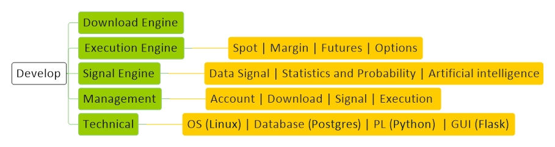

# [Develop](../index.md) 

[Economy](economy.md) |
[Technology](technology.md) |
[Forex](forex.md) |
[Crypto](crypto.md) |
[Mining](mining.md) |
[Wallet](wallet.md) |
[Techniqual](techniqual.md) |
[Project](project.md) |
[Analysis](analysis.md) |
[Strategy](strategy.md) |
[Execution](execution.md) |
[Data](data.md) |
[Develop](develop.md) |
[Resource](resource.md)

 
<a href="#concept">Concept</a> -
<a href="#data">Data</a> -
<a href="#note">Note</a>
<a href="#api">API</a> - 
<a href="#script">Script</a>

<!-----------------------------------------------------------Concept----------------------------------------------------------->

## Concept

<!-----------------------------------------------------------API----------------------------------------------------------->

## API

<table class="tbl1"><tbody>
<tr><td colspan="4" align="center" bgcolor="D1ECCF">Real</td></tr>
<tr>
<td align="center">Type</td>
<td align="center">Base URL</td>
<td align="center">Method</td>
<td align="center">PostMan</td>
</tr>
<tr>
<td align="center">Spot/Margin/Saving/Mining</td>
<td align="center">https://api.binance.com</td>
<td align="center">/api/v3/ping   /sapi/v1/margin/</td>
<td align="center">Binance spot API</td>
</tr>
<tr>
<td align="center">USD-M Futures</td>
<td align="center">https://fapi.binance.com</td>
<td align="center">/fapi/v1/ping</td>
<td align="center">Binance perpetual future API</td>
</tr>
<tr>
<td align="center">Coin-M Futures</td>
<td align="center">https://dapi.binance.com</td>
<td align="center">/dapi/v1/time</td>
<td align="center">Binance delivery futures API</td>
</tr>
<tr>
<td align="center">Vanilla Options</td>
<td align="center">https://vapi.binance.com</td>
<td align="center">/vapi/v1/ping</td>
<td align="center"></td>
</tr>
</tbody></table>

Zcash : libsnark : libreary for Zero-Knowledge Proofs

<!-----------------------------------------------------------Script----------------------------------------------------------->

## Script

2a = a + (a/2) + (a/4) + (a/8) + (a/16) + .... + (a/(2^n))

    x = y =  50
    count =1

    while True :
        last = y
        print(f'{count}                  x:{x}                   y:{y}')
        y = y + (x/2)
        x = x/2
        if(last==y): break
        count += 1

<!-----------------------------------------------------------Note----------------------------------------------------------->

## Note

Zcash : libsnark : libreary for Zero-Knowledge Proofs

