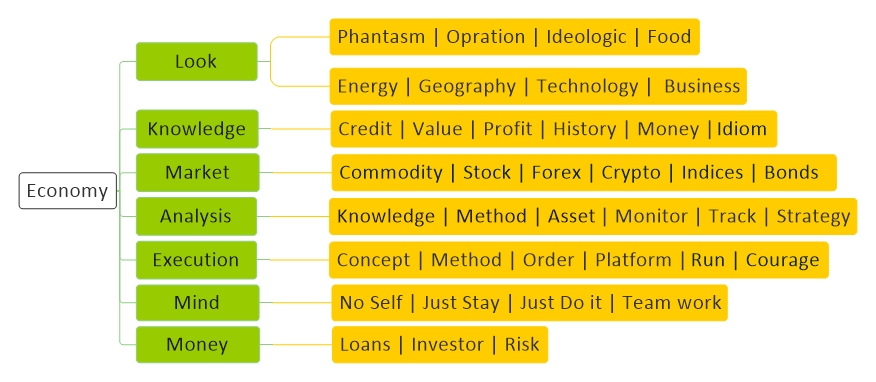
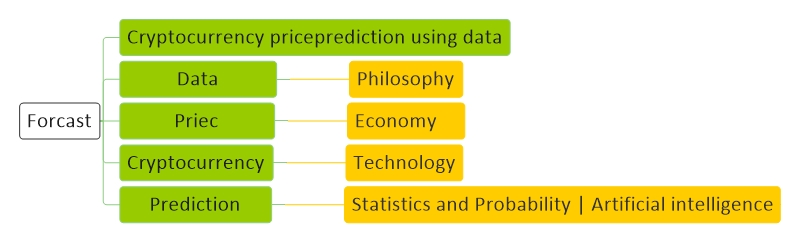

<!----------------------------------------------------------------------------------[Index]-->
# [Economy](../index.md) 

<!----------------------------------------------------------------------------------[Pages]-->
[Economy](economy.md) |
[Technology](technology.md) |
[Forex](forex.md) |
[Crypto](crypto.md) |
[Mining](mining.md) |
[Wallet](wallet.md) |
[Techniqual](techniqual.md) |
[Project](project.md) |
[Analysis](analysis.md) |
[Strategy](strategy.md) |
[Execution](execution.md) |
[Data](data.md) |
[Develop](develop.md) |
[Resource](resource.md)

<!----------------------------------------------------------------------------------[Diagram]-->

<a href="#look">Look</a> - 
<a href="#knowledge">Knowledge</a> - 
<a href="#market">Market</a> -
<a href="#mind-management">Mind</a> -
<a href="#money-management">Money</a> -
<a href="#index">Index</a> -
<a href="#note">Note</a>

<!-----------------------------------------------------------Look----------------------------------------------------------->

## Look 

<!---------------------------------------Phantasm-->
#### Phantasm 

<!-- Self Base -->

Self Base

 بر اساس اینکه تشخیص بدم چه اتفاقی خواهد افتاد جلو میرود

<!-- Market Base -->

Self Base

بر اساس اینکه مارکت به چه سمتی حرکت میکند جلو میرود

<!---------------------------------------Operation-->
#### Operation 

<!---------------------------------------Ideologic-->
#### Ideologic

<!---------------------------------------Food-->
#### Food

<!---------------------------------------Energy-->
#### Energy

Oil | Gas | Solar

<!---------------------------------------Geography-->
#### Geography

Middle East | Iran | China | Usa | Europe

<!---------------------------------------Business-->
#### Business

دنبال پول باش  و درگیر حاشیه نشو  مثل مسایل فنی

همشیه مسایل رو از کل به جز بررسی کن و همچنین از جز به کل

کالا ها را از ارزانترین به گرانترین برسی کن و در همان لحظه از گرانترین به ارزانترین نیز بررسی کن

با اینکه فکر میکنی داره میره بالا اما احتمال زیاد بده کف  های گذشته رو ممکنه ببینه

 (کم ریسکا) در اولین فرصت سرمایه اولیه رو کنار بگذار تا آرامش حاصل بشه

با توجه به تحمل و صبر استراتژی اتخاذ کن ممکنه یکی نقدینگی سرمایش بیشتر مهم باشه

هر چیزی که فکر میکنی درسته یه مدت ببرش تو محیط تست

قانون اول  : سرمایه اولیت رو از دست نده

قانون دوم : نسبت سود به ضرر باید ۳ به ۱ باشد

قانون سوم : فقط ۱ درصد از کل سرمایه  ات را می توانی ریسک کنی

قانون چهارم : معامله ی بدون TP و  SL بی اعتبار است

قانون پنجم : در حین معامله میتونی TP رو تغییر بدی اما SL رو به هیچ وجه

قانون ششم  : بیش از حد معامله نکن

قانون هفتم  :  دنبال جبران ضرر و انتقام از بازار نباش

قانون هشتم  : اندازه حدت ترید کن یعنی اگه اون مقدار سرمایه ازبین رفت واست فرقی نکنه

قانون هشتم  : با یک ترید نخواه کل ضرر هاتو جبران کنی

قانون نهم  : حجم معامله برای سود رو با انتظار پیشروی بیشتر روند اشتباه نگیر

<!-----------------------------------------------------------Knowledge----------------------------------------------------------->

## Knowledge 

<!---------------------------------------Root-->
#### Root

اگر انسان اجتماعی نبود رابطه برایش بی معنی بود و تک نفره زندگی میکرد و میرفت جلو و کاری به کسی نداشت

چون اجتماعی هست پس  روابط معنی پیدا میکنه و لازمه رابطه مفهومی است به نام : ارزش

پس خیلی ساده اقتصاد رو میشه اینجوری تعریف کرد : اقتصاد یعنی تعیین ارزش و تبادل آن

<!---------------------------------------Value-->
#### Value

حالا برای انسان چه چیزهایی ارزش پیدا میکند ؟

<!-- Need -->

Need

چون انسان موجودی نیازمند هست پس چیزهایی که مربوط به نیازهاش است براش ارزش پیدا میکند

نیازهای فیزیکی : غذا | لباس | ابزار | آب

نیازهای روحی :قدرت | تسلط |  خاص بودن | مشارکت | یه کاری کردن | زیبایی | تنوع | پیشرفت | حرص | طمع

<!-- Need -->

Properties

چیزهایی که کارایی دارن و منتهی به برآورده کردن نیازهای انسان دارن مانند طلا

<!-- Limited -->

Limited

هر چیزی که محدود باشه برای انسان ارزش پیدا میکند شای برای ارضای حس خاص بودن

<!-- Foresight -->

Foresight

هر چیزی که کارایی داشته باشه برای انسان ارزش پیدا میکند چون در راستای برآورده کردن نیازهای انسان قرار میکیرد

<!-- Fear of losing -->

Fear of losing

ترس از دست دادن احساسی هست که حتی ممکنه چیزی که ذاتا ارزش ندارد برای انسان ارزشمند سود

<!-- Participation -->

Participation

مشارکت حسی است که انسان برای ارضای آن به یه سری چیزها ممکنه ارزش بدهد

<!---------------------------------------Credit-->
#### Credit

<!---------------------------------------Profit-->
#### Profit

حالا یه انسان چه جوری میتونه سود بدست بیاره ؟

<!-- Production -->

Production

اینکه بتونی ارزش تولید کنی مثل کشاورزی | دامداری | صنعت

<!-- Brokerage -->

Brokerage

یا بر اساس تغییر قیمت سود کنی

<!---------------------------------------History-->
#### History

تاریخ

انسان اولیه نیازهاشو از طبیعت میگرفت و نیاز به مبادله نداشت اما بعد یک جا نشین شد و نیاز به داد و ستد پیدا کرد

<!-- مبادله کالا به کالا -->

مبادله کالا به کالا

گندم میداد شیر میگرفت یا سیب میداد برنج می گرفت اما یه سری مشکلات داشت :

گندم میداد اما روغن میخواست در صورتی که طرف مقابل گندم نداشت - مشکل ارزش گذاری : چی جوری مشخص کنن چقدر گندم بدن و چقدر شیر بگیرن؟ - مشکل تقسیم پذیری : طرف میخواست ۱۰ کیلو گندم بده و یک کیلو گوشت بگیره نه اینکه اندازه یه گوسفند کامل گندم بده - مشکل حمل و نقل - مشکل خراب شدن کالا  

<!-- پول کالایی -->

پول کالایی

مثلا نمک یه جا ارزش داشت و شد واسط مبادله اما تو یه منطقه دیگه اون نمکه ارزش زیادی نداشت

<!-- سکه طلا -->

سکه طلا

این خوب بود اما مشکل حمل و نقل و امنیت داشت

<!-- پول کاغذی -->

پول کاغذی

طلاها رو گذاشتن تو یه انبار و به جاش یک کاغذ دادن که اثبان میکرد شما چقدر طلا در انبار داری و اون کاغذ مبادله میشد

در سال 1944 در کنفرانس Bretton woods توافق شد هر 35 دلار معادل 1 اونس طلا که میشود 28.349 گرم 

چون آمریکا از همه بیشتر طلا داشت - قرار شد بقیه کشورها بر اساس دلار پول خود را ارزش گذاری کنن و آمریکا قول داد بدون پشتوانه دلار چاپ نکنه اما به قولش عمل نکرد و ملت فهمیدن و شروع کردن دلار هارو پس دادن و به جاش طلا گرفتن

در سال ۱۹۷۱ معروف به شُک نیلسون آمریکا گفت دلار بیارید دیگه بهتون طلا نمیدم یعنی عملا گفت دارم بدون پشتوانه دلار چاپ میکنم

<!-- پول الکترونیکی -->

پول الکترونیکی

علم پیشرفت کرد و گفتن دیگه الکی کاغذ چاپ نکنیم - اعداد رو تو کامپیوتر تغییر میدیم

<!-- 2008 -->

2008

آمریکا نرخ بهره رو آورد پایین و ملت وام گرفتن و شروع کردن به خونه خریدن و تقاضا برای خرید خونه زیاد شد و یهو قیمت خونه ۱۲۵ درصد رشد کرد

یه سری ملت هم رفتن وام گرفتن و خونه ساختن و یهو عرضه خونه زیاد شد و قیمت خونه شدید افت کرد

طرف 100 تومن وام گرفته  و تا الان 20 تا هم قسط داده یعنی خونه تا الان براش در اومده ۱۲۰ تومن اما قیمت خونه شده ۶۰ تومن خب برای چی باید دوباره قسط وامشو بده میگه ولش کن بانک بیاد خونه رو بگیره اصلا

ملت قسط وام رو نمیدادن و بانک میومد خونه رو میگرفت اما اگه تازه میتونست بفروشه نصف قیمت باید میروخت یعنی حتی اصل پولشم برنمیگشت

ملتی که قبلا پولشونو داده بودن به بانک یهو ترسیدن رفتن گفتن پول مارو بده اما بانک پول نداشت که بده و همه بانک ها دومینو وار ورشکسته شدند

<!---------------------------------------Money-->
#### Money

پول در واقع نماینده یک ارزش است

پول ابزاری است برای : مبادله | اندازه گیری |  ذخیره ارزش

<table align="center"><tbody>
<tr><td colspan="6" align="center" bgcolor="D1ECCF">خصویت هایی که پول باید داشته باشد</td></tr>
<tr>
<td  align="center">Fungibility</td>
<td  align="center">Scarcity</td>
<td  align="center">Divisibility</td>
<td  align="center">Transferability</td>
<td  align="center">Liquidity</td>
<td  align="center">Legitimacy</td>
</tr>
<tr>
<td  align="center">قابلیت تعویض</td>
<td  align="center">کمبود</td>
<td  align="center">تقسیم پذیری</td>
<td  align="center">قابلیت انتقال</td>
<td  align="center">نقدینگی</td>
<td  align="center">مشروعیت</td>
</tr>
</tbody></table>

<!---------------------------------------Finance-->
#### Finance

یه نوع دارایی داریم که نقد هست مثل پول و یه نوع دارایی داریم که نقد نیست مثل خونه

اگر ارزش دارایی‌های غیر نقد تغییر کند زیاد تاثیری تو زندگیمون ندارد اما دارایی‌های نقد چرا

تمرکز فساد می آورد

دولت پول چاپ میکند و تورم ایجاد میشود و ارزش پول پایین میآید

پایان دوران پول کلاسیک رسیده است

مراحل سرمایه گذاری : پولهای هوشمند (نخبگان) - شرکت ها و موسسات - مردم عادی

تحلیل بنیادی : تشخیص قیمت واقعی

 January ماه مالیات است

یه ارزش ذاتی داریم و یه ارزش بازار

<!--------------------------------------Idioms-->
## Idioms

<!-----------Economy-->
<table><tbody><tr><td>
    <table><tbody>
    <tr><td colspan="2" align="center" bgcolor="D1ECCF">Economy</td></tr>
    <tr><td align="center">CeFi</td><td align="center">Centralized Finance

اقتصاد متمرکز</td></tr>
    <tr><td align="center">DeFi</td><td align="center">Decentralized Finance

اقتصاد غیر متمرکز</td></tr>
    <tr><td align="center">CeDeFi</td><td align="center">Centralized Decentralized finance

در مدیریت متمرکز اما در استفاده غیر متمرکز</td></tr>
    <tr><td align="center">DAO</td><td align="center">Decentralized Autonomous Organization

سازمان های غیر متمرکز خودکار </td></tr>
    <tr><td align="center">CFTC</td><td align="center">Commodity Futures Trading Commission

بورس آتی کالا</td></tr>
    <tr><td align="center">CPI</td><td align="center">Consumer price index شاخص تورم مشتری - یعنی اگه الان خودکار ۱۰۰ تومنه سال دیگه چنده</td></tr>
    <tr><td align="center">Fractional Reserve</td><td align="center">هرچی بانک بیشتر جذب سرمایه کنه بیشتر میتونه وام بده یعنی همون پول چاپ کردن</td></tr>
    <tr><td align="center">ETF</td><td align="center">Exchange-Traded Fund ETF سبدی از دارایی‌ها از جمله سهام، اوراق قرضه، کالا یا ارز را در نظر می‌گیرد</td></tr>
    <tr><td align="center">CBDC</td><td align="center">Central Bank Digital Currency ارزهایی که بانک های مرکزی دنیا دارن استفاده میکنند</td></tr>
    <tr><td align="center">Arbitrage</td><td align="center"></td></tr>
    <tr><td align="center">SEC</td><td align="center">urities and Exchange: شششش</td></tr>
    <tr><td align="center">Option</td><td align="center"></td></tr>
    </tbody></table>
</td></tr></tbody></table>

<!-----------Crypto-->
<table><tbody><tr><td>
    <table><tbody>
    <tr><td colspan="2" align="center" bgcolor="D1ECCF">Crypto</td></tr>
    <tr><td align="center">DIF</td><td align="center">aaaa   بنیاد هویت غیر متمرکز</td></tr>
    <tr><td align="center">STO</td><td align="center">Security token offering توکن هایی که برای اوراق بهادار استفاده میشوند</td></tr>
    <tr><td align="center">ICO</td><td align="center">Initial coin offering  جایی که برای اولین بار بصورت خصوصی توکن را معرفی میکنند تا سرمایه گذار جذب کنند</td></tr>
    <tr><td align="center">IEO</td><td align="center">Initial exchange offering همان ICO اما صرافی متمرکز میاد این کار رو انجام میده : Binance lunchpad</td></tr>
    <tr><td align="center">IDO</td><td align="center">Initial DEX Offering همان ICO اما صرافی غیر متمرکز میاد این کار رو انجام میده : UniSwap </td></tr>
    <tr><td align="center">FTO</td><td align="center">Fan Token Offering مثلا باشگاه فوتبال بخواد برای هوادارانش Token تعریف کنه</td></tr>
    <tr><td align="center">IPO</td><td align="center">Initial Public Offering</td></tr>
    <tr><td align="center">CDBC</td><td align="center">aaa توکن هایی که بانک های مرکزی توسعه میدهند</td></tr>
    <tr><td align="center">BPM</td><td align="center">Bussiness X X aaa</td></tr>
    <tr><td align="center">Custodian</td><td align="center">شرکت هایی که مجوز امنیتی SOC2 دارند که میتوانند از دارایی های شما حضانت کنند Coinbase, Bitgo, Gemini</td></tr>
    </tbody></table>
</td></tr></tbody></table>

<!-----------Techniqual-->
<table><tbody><tr><td>
    <table><tbody>
    <tr><td colspan="2" align="center" bgcolor="D1ECCF">Techniqual</td></tr>
    <tr><td align="center">TPS</td><td align="center">Transactions Per Second  : تعداد تراکنش ها در ثانیه</td></tr>
    <tr><td align="center">PCV</td><td align="center">نقدینگی در کنترل پروژه</td></tr>
    <tr><td align="center">TVL</td><td align="center">Total value locked : مقدار توکنی که برای این پروژه قفل شده است</td></tr>
    <tr><td align="center">IPFS</td><td align="center">InterPlanetary File System : ذخیره اطلاعات بصورت غیر متمرکز</td></tr>
    <tr><td align="center">MPC</td><td align="center">Multi Party Computation : کلید رو تیکه تیکه کردی</td></tr>
    <tr><td align="center">DAG</td><td align="center">Directed acyclic graph : شششش</td></tr>
    <tr><td align="center">Off-Chain</td><td align="center">پروژه های لایه ۲ ایی که بیرون شبکه کاری رو انجام میدهند و بعد به شبکه منتقل می کنند</td></tr>
    <tr><td align="center">Rollup</td><td align="center">میگه من یه سری تراکنش ها رو جمع میکنم رول میکنم میدم پایین تو شبکه</td></tr>
    <tr><td align="center">Rollup Optimistic</td><td align="center"> رول رو بدون بررسی میفرسته تو شبکه و اگه مشکل داشت رول رو برمیگردونه</td></tr>
    <tr><td align="center">Rollup ZK</td><td align="center"> رول رو اول بررسی میکنه و بعد میفرسته تو شبکه</td></tr>
    <tr><td align="center">Proof of History</td><td align="center">این تراکنش قبل  و بعد کدام بلاک ها هست</td></tr>
    <tr><td align="center">AMM</td><td align="center">Automated Market Maker : کسانی که میرن تو پروژه ها پول میزارن</td></tr>
    <tr><td align="center">LAAS</td><td align="center">Liquidity as a Service : پروژه هایی که برای پروژه های دیگه نقدینگی میارن</td></tr>
    <tr><td align="center"></td><td align="center">مثلا داخل صرافی پول میزاری و بابتش سود میکیری</td></tr>
    <tr><td align="center">Active Liquidity</td><td align="center"></td></tr>
    <tr><td align="center">Flexible Fee</td><td align="center"></td></tr> 
    <tr><td align="center"></td><td align="center">مثلا داخل صرافی پول میزاری و بابتش سود میکیری</td></tr>
    <tr><td align="center">Liquidity Provider Liquidity mining</td><td >کسانی که در صرافی پول میزارن تا صرافی پول در گردش داشته باشه و صرافی با کارمزدی که از تراکنش ها میگیره به اینا سود میده</td></tr>
    <tr><td align="center">Liquide Staking</td><td align="center">پولی که داخل پروژه میزاری قفل نمیشه و میتونه برای کارهای دیگه هم استفاده بشه</td></tr>
    <tr><td align="center">Concentrated Liquidity</td><td align="center">یعنی توکنی که من قفل میکنم تو پروژه ات را در بازه قیمتی ۱۰۰ تا ۳۰۰ کار کن باهاش</td></tr>
    <tr><td align="center">Impermanent Loss</td><td align="center">شمایه پولی میزارین داخل یه پروژه و اگه نمیزاشتین بیشتر سود میکردین</td></tr>
    <tr><td align="center">Launchpad</td><td align="center">جایی برای عرضه اولیه توکنها مانند :Binance Launchpad   Type : Random | Lock Token   White list : اونایی که برنده شدن</td></tr>
    <tr><td align="center">Wrapped Token</td><td align="center">مثلا میای تو اتریوم یه توکن تعریف میکنی که پشتوانش بیتکوین هست</td></tr>
    <tr><td align="center">Degeneconomy</td><td align="center">توکنی که عمر دارد و پس از یه زمانی از بین میبرد و یه جوری Option رو داره پیاده سازی میکند </td></tr>
    <tr><td align="center">Rebase Token Elastic Token</td><td align="center">توکنی که محدود است و ممکنه تعدادشون هم کم بشه هم زیاد بشه - برای کنترل تورم و وابستگیشون به Bitcoin این کار را میکنند</td></tr>
    <tr><td align="center" width="190">Coin Join Mixing Coin Shuffle</td><td align="center">مثلا از ۱۰۰۰ نفر تراکنش میگیره و از این به اپن میزنه که معلوم نشه کی به کی پول داده</td></tr>
    <tr><td align="center">Interoperability</td><td align="center">اشتراک گذاری فضا و پراسس و امنیت بین شبکه های Blockchain</td></tr>
    </tbody ></table>
</td></tr></tbody></table>

<!-----------Other-->
<table><tbody><tr><td>
    <table><tbody>
    <tr><td colspan="2" align="center" bgcolor="D1ECCF">Other</td></tr>
    <tr><td align="center">Generative Art</td><td align="center">هنرهایی که با برنامه نویسی و هوش مصنوعی تولید میشوند مانند : game of life</td></tr>
    <tr><td align="center">Steganography</td><td align="center">مخفی کردن پیغام در عکس</td></tr>
    <tr><td align="center">RBF</td><td align="center">Replace by Fee : سس</td></tr>
    <tr><td align="center">Game of Life</td><td align="center">age hamsaye kenarihat bidar bashan to ham bidari be ehtemale ziad , raftar bar asase atrafian</td></tr>
    <tr><td align="center">Carbon Neutrality</td><td align="center">yani har chi carbon tolid mikonam miram az charkhe kharej mikona</td></tr>
    <tr><td align="center">Li-Fi</td><td align="center">وای فای نوری</td></tr>
    <tr><td align="center">Finality</td><td align="center">چقدر صبر کنیم تا بلاک قطعی بشود</td></tr>
    <tr><td align="center">ReOrg</td><td align="center">بعد از حمله برمیگردن عقب و بلاک ها را درست میکنند</td></tr>
    <tr><td align="center">Coin</td><td align="center"></td></tr>
    <tr><td align="center">Token</td><td align="center"></td></tr>
    <tr><td align="center">Halving</td><td align="center"></td></tr>
    <tr><td align="center">Fork</td><td align="center"></td></tr>
    <tr><td align="center">Social KYC</td><td align="center"></td></tr>
    <tr><td align="center">Credit Score</td><td align="center"></td></tr>
    <tr><td align="center">EIP</td><td align="center"></td></tr>
    <tr><td align="center">BIP</td><td align="center"></td></tr>
    <tr><td align="center">Token Locking</td><td align="center">برای هر پروژه DeFi لازم است یک مقدار Token قفل بشه</td></tr>
    <tr><td align="center">Soft Staking</td><td align="center">هر موقع دلت بخپاد پولتو برمیداری</td></tr>
    <tr><td align="center">Flexible Stakig</td><td align="center">مثلا یک ساله</td></tr>
    <tr><td align="center">ISA</td><td align="center">Income Share Agreements طرف قابلیت خودشو توکن کرده</td></tr>
    <tr><td align="center">in out money analysts</td><td align="center">بیا آدرس های هولدر رو نگاه کن ببین کی خریده و با چه قیمتی و با قیمت الان بررسی کن ببین تو سوده یا ضرر</td></tr>
    <tr><td align="center">BIP</td><td align="center"></td></tr>
    <tr><td align="center">فاینالیتی</td><td align="center">الان تراکنش میزنم کی میشینه تو حساب طرف  در این پروژه در لحظه است</td></tr>
    <tr><td align="center">Digital Watermarking</td><td align="center">bbbb</td></tr>
    <tr><td align="center">NNS</td><td align="center">bbbb</td></tr>
    <tr><td align="center">Federated</td><td align="center">بررسی دارایی اشخاص</td></tr>
    <tr><td align="center">Gulf Stream</td><td align="center">bbbb</td></tr>
    <tr><td align="center">Share to Earn</td><td align="center">bbbb</td></tr>
    <tr><td align="center">aaa</td><td align="center">bbbb</td></tr>
    <tr><td align="center">aaa</td><td align="center">bbbb</td></tr>
    <tr><td align="center">aaa</td><td align="center">bbbb</td></tr>
    <tr><td align="center">aaa</td><td align="center">bbbb</td></tr>
    </tbody></table>
</td></tr></tbody></table>

<!-----------tbl-2-->
<table border="0" align="left" valign="top"><tbody><tr>
    <!-- td 1 -->
    <td valign="top">
        <table ><tbody>
        <tr><td colspan="2" align="center" bgcolor="D1ECCF">Idioms</td></tr>
        <tr>
        <td  align="center">Exchange</td>
        <td align="center">تبادل</td>
        </tr>
        <tr>
        <td  align="center">Fiat</td>
        <td align="center">همین پولهای رایج</td>
        </tr>
        <tr>
        <td  align="center">Double Spending</td>
        <td align="center">دو بار خرج کردن</td>
        </tr>
        <tr>
        <td  align="center">Ledger</td>
        <td align="center">دفتر لاگ معاملات</td>
        </tr>
        <tr>
        <td  align="center">Rules</td>
        <td align="center">قوانین</td>
        </tr>
        <tr>
        <td  align="center">Decentralize</td>
        <td align="center">غیر متمرکر</td>
        </tr>
        <tr>
        <td  align="center">Consensus</td>
        <td align="center">اجماع</td>
        </tr>
        <tr>
        <td  align="center">Fungibility</td>
        <td align="center">مثل هم بودن</td>
        </tr>
        <tr>
        <td  align="center">Scarcity</td>
        <td align="center">محدود</td>
        </tr>
        </tbody></table>
    </td>
    <!-- td 2 -->
    <td valign="top">
        <table border="0" align="left"><tbody>
        <tr><td colspan="2" align="center" bgcolor="D1ECCF">Idioms</td></tr>
        <tr><td  align="center">Divisibility</td><td align="center">قابل تقسیم</td></tr>
        <tr><td  align="center">Durability</td><td align="center">مالکیت</td></tr>
        <tr><td  align="center">Transferability</td><td align="center">قابل انتقال</td></tr>
        <tr><td  align="center">Liquidity</td><td align="center">نقدینگی</td></tr>
        <tr><td  align="center">Legitimacy</td><td align="center">مشروعیت</td></tr>
        <tr><td  align="center">Mempool</td><td align="center">TRX محل قرار گیری </td></tr>
        <tr><td  align="center">Difficulty Network</td><td align="center">سختی شبکه</td></tr>
        <tr><td  align="center">Anonymity</td><td align="center">ناشناسی</td></tr>
        <tr><td  align="center">Reward</td><td align="center">جایزه</td></tr>
        </tbody></table>
    </td>
</tr></tbody></table>

<!-----------tbl-3-->
<table><tbody><tr>
    <!-- td 1 -->
    <td valign="top">
        <table border="0" align="left"><tbody>
            <tr><td colspan="2" align="center" bgcolor="D1ECCF">Idioms</td></tr>
            <tr><td  align="center">Margin</td><td align="center">‌مقدار پول واقعی که در معاملات درگیر هست</td></tr>
        </tbody></table>
    </td>
</tr></tbody></table>

<!-----------------------------------------------------------Market----------------------------------------------------------->

## Market

<!---------------------------------------Commodity -->
#### Commodity 

<!---------------------------------------Stock -->
#### Stock

<!---------------------------------------Forex -->
#### Forex

<!---------------------------------------Crypto-->
#### Crypto

<!---------------------------------------Indices-->
#### Indices

<!---------------------------------------Bonds-->
#### Bonds

<!-----------------------------------------------------------Mind Management----------------------------------------------------------->

## Mind Management

<!---------------------------------------No Self-->
#### No Self

<!---------------------------------------Just Stay-->
#### Just Stay

<!---------------------------------------Just Do it-->
#### Just Do it

<!---------------------------------------Team work-->
#### Team work

<!-----------------------------------------------------------Money Management----------------------------------------------------------->

## Money Management

<!---------------------------------------Loans-->
#### Loans

<!---------------------------------------Investor-->
#### Investor

<!---------------------------------------Risk-->
#### Risk

<!-----------------------------------------------------------Index----------------------------------------------------------->

## Index

<!---------------------------------------MVRV-->
#### MVRV

<!-----------------------------------------------------------Note----------------------------------------------------------->

## Note

