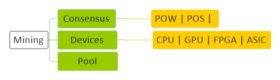

# [Mining](../index.md) 

[Economy](economy.md) |
[Technology](technology.md) |
[Forex](forex.md) |
[Crypto](crypto.md) |
[Mining](mining.md) |
[Wallet](wallet.md) |
[Techniqual](techniqual.md) |
[Project](project.md) |
[Analysis](analysis.md) |
[Strategy](strategy.md) |
[Execution](execution.md) |
[Data](data.md) |
[Develop](develop.md) |
[Resource](resource.md)

<a href="#diagram">Diagram</a> - 
<a href="#concept">Concept</a> -
<a href="#consensus">Consensus</a> -
<a href="#devices">Devices</a> -
<a href="#pool">Pool</a> -
<a href="#note">Note</a>

<!-----------------------------------------------------------Concept----------------------------------------------------------->

## Concept

1 - یه سری آدم دارن پول انتقال میدان، که مثلا چه مقدار پول از کجا به کجا انتقال پیدا کند، به اینها میگن Transaction = TRX

2 - تراکنشهای جدید به تمامی نودها مخابره میشوند

3 -  ماینر ها تراکنشها را میگیرند و در MemPool خود ذخیره می کنند 

4 - Trx مخصوص که مشخص کننده جایزه ماینر هست را هم اضافه می کند

5 - یک Nonce هم اضافه می کند

6 - Hash بلاک قبلی‌ رو هم اضافه می‌کند

7 - Hash این مجموعه اطلاعات رو حساب می کند

8 - Hash ساخته شده را با قانون POW بررسی می کند

9 - اگر طبق اون قانون نبود، Nonce را عوض می کند و دوباره Hash را حساب می کند

10 - اگر طبق اون قانون بود، او برنده شده است و اون مقدار جایزه برای او خواهد شد و به شبکه اعلام می کند

11 - سایر نودها بلوک مذکور را تنها در شرایطی میپذیرند که کل تراکنشهای آن صحیح با شند و قبلا خرج نشده باشند

12 - سایر نودها موافقت خود را با بلوک مورد نظر با ایجاد بلوک بعدی در زنجیره اعلام میدارند و بهاین منظور از هش بلوک پذیرفته شده به عنوان هش قبلی استفاده میکنند

Nonce

Difficulty

Reward

<!-----------------------------------------------------------Consensus----------------------------------------------------------->

## Consensus

سازکار و روشهایی برای اعتماد و به توافق رسیدن افراد فعال داخل شبکه

<!--------------------------------------POW (Proof of Work)-->
#### POW (Proof of Work)

انرژی زیاد مصرف میکنه

<!--------------------------------------POS (Proof of Stake)-->
#### POS (Proof of Stake)

هر چه دارایی بیشتر احتمال شانس ولیدیت بیشتر و همچنین جریمش هم بیشتر

در اتریوم ۲ دیگه نمیخواد همه  اطلاعات بلاکچین رو داشته باشی

اتریوم درجه سختی شبکه رو اینقدر میبره بالا تا کاربرها بیان به سمت اتریوم ۲

<!--------------------------------------DPoS (Delegated Proof of Stake)-->
#### DPoS (Delegated Proof of Stake)

من که مقدار توکنم کمه شانسم کم میشه پس حق رای خودمو میدم به کسی که شانسش بیشتره و اون اگه ماین کرد به منم یه درصدی میده

66% باید اجماع کنند

<!--------------------------------------LPoS (Liquid Proof of Stakee)-->
#### LPoS (Liquid Proof of Stakee)

همان DPos با این تفاوت که نماینده من خودش میتونه حق رای خودشو به یکی دیگه بده

<!--------------------------------------Proof of Space-->
#### Proof of Space

<!--------------------------------------Proof of Time-->
#### Proof of Time

<!--------------------------------------POA-->
#### POA

<!--------------------------------------POSA-->
#### POSA

DPOS + POA

Project : BSC

<!--------------------------------------POC (Proof of Coverage)-->
#### POC (Proof of Coverage)

<!--------------------------------------proof of learning-->
#### proof of learning

<!--------------------------------------Proof of Authority-->
#### Proof of Authority

Azure BaaS

<!--------------------------------------Cpu + Memory-->
#### Cpu + Memory Hashing

وقتی‌ POW بر اساس محاسبات باشه پس می‌شه دستگاهی درست کرد که فقط همون محاسبات خاص رو انجام بده(ASIC)

حالا اگر مموری رو هم بیاریم تو بازی، اگر میخوان قدرت محاسباتشون بره بالا حتما باید مموری اضافه کنند و این هزینه بر هست

مانند Equihash که در کوین ZCash استفاده شده است

مانند Litecoin که در کوین Scrypt استفاده شده است

<!--------------------------------------Proof of useful work-->
#### Proof of useful work

setiathome.berkeley.edu

www.foldingathome.org

prime search

<!--------------------------------------Proof of storage-->
#### Proof of storage

Permacoin

BurstCoin

<!--------------------------------------non-outsourceable-->
#### non-outsourceable

فقط شخصی‌ بشود ماین کرد

<!--------------------------------------Proof of stake or virtual mining-->
#### Proof of stake or virtual mining

چرا پول بدیم به دستگاه ماینر سازا و شرکت برق برای ماین کردن کردن 

 خوب هزینه ایی که می‌خوای بکنی‌ رو بده کوین بخر و شانس ماین کردنت رو ببر بالا

PeerCoin

Dash

<!-----------------------------------------------------------Devices----------------------------------------------------------->

## Devices

<table><tbody>
<tr><td colspan="2" align="center" bgcolor="D1ECCF">Devices</td></tr>
<tr>
<td  align="center">CPU</td>
<td align="center">20 میلیون در ثانیه</td>
</tr>
<tr>
<td  align="center">GPU</td>
<td align="center">200 میلیون در ثانیه</td>
</tr>
<tr>
<td  align="center">FPGA</td>
<td align="center">دستگاهایی که فقط یک کار را انجام میدهند (1 گیگ در ثانیه)</td>
</tr>
<tr>
<td  align="center">ASIC</td>
<td align="center">دستگاهایی که فقط کار مشخص ما را انجام می دهند (120 گیگ در ثانیه)</td>
</tr>
</tbody></table>

#### companies

Bitmain | MicroBT

<!-----------------------------------------------------------Pool----------------------------------------------------------->

##  Pool

یک سری ماینر جمع میشوند و روی یک بلاک کار میکنند، هر کی‌ برنده شد به بقیه هم اندازهٔ قدرت محاسبشون پول میده

<!-----------------------------------------------------------Note----------------------------------------------------------->

## Note

