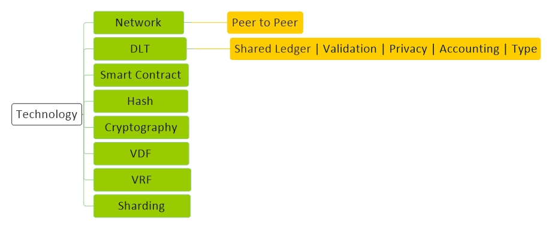
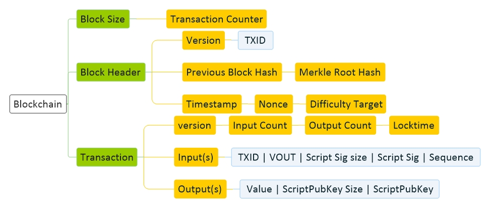

# [Technology](../index.md) 

[Economy](economy.md) |
[Technology](technology.md) |
[Forex](forex.md) |
[Crypto](crypto.md) |
[Mining](mining.md) |
[Wallet](wallet.md) |
[Techniqual](techniqual.md) |
[Project](project.md) |
[Analysis](analysis.md) |
[Strategy](strategy.md) |
[Execution](execution.md) |
[Data](data.md) |
[Develop](develop.md) |
[Resource](resource.md)

 
<a href="#dlt-distributed-ledger-technology">DLT</a> - 
<a href="#dlt---blockchain">BlockChain</a> - 
<a href="#dlt---tangle">Tangle</a> - 
<a href="#dlt---hashgraph">Hashgraph</a> -
<a href="#sharding">Sharding</a> - 
<a href="#smart-contract">Smart Contract</a> - 
<a href="#hash">Hash</a> - 
<a href="#cryptography">Cryptography</a> - 
<a href="#vdf">VDF</a> - 
<a href="#vrf">VRF</a> -
<a href="#note">Note</a>

<!-----------------------------------------------------------DLT----------------------------------------------------------->

## DLT (Distributed ledger technology)

دفتر کار توضیع شده

دفتری برای ذخیره دیتا است.  دیتا بر روی همه نودهای شبکه نوشته میشود 

چی مینویسن ؟ مینویسن فلانی اینقدر به فلانی انتقال داد

حالا کی میتونه بنویسه ؟ کسانی که یه اثباتی رو انجام بدهند

اگه اشتباه بنویسه چی؟ چون پاداش دارد  انگیزه برای اشتباه نوشتن وجود ندارد

شفافیت | تغییر ناپذیری | گم نامی | امنیت

قلب تپنده اجماع است

اگر اجماع اتفاق نیوفتد Fork اتفاق می افتد

ماینر نباشد امنیت میرود

هر چه غیر متمرکز تر مقیاس پذیری کمتر

HyperLedger | Corda | R3 : بلاک چین خصوصی یا بلاک چین سازمانی

BaaS (Blockchain as a Service) : IBM | Salesforce | Microsoft | Amazon | Alibaba | Oracle | Huawei | Zeeve

Decentralization | Scalability | Security

<!--------------------------------------Shared Ledger -->
#### Shared Ledger

Blockchain | Tangle | Tangle | Dag | HoloChain | Tempo

<!--------------------------------------Accounting -->
#### Accounting

Account base : یعنی یه شماره حساب داریم و یک عدد موجودی در مقابلش

Coin base (UTXO) : کوین رو دنبال میکنه از کجا اومده و کجاها چرخیده  و الان دست کی هست

<!--------------------------------------Type -->
#### Type
<!-- Publick -->

Publick

همه میتونن بنویسن و همه میتونن بخونن

<!-- Private -->

Private

بعضی ها فقط میتونن بنویسن و بعضی ها فقط میتونن بخونن

<!-- Consortium -->

Consortium

بعضی ها میتونن بنویسن اما همه میتونن بخونن

<!-----------------------------------------------------------DLT - BlockChain----------------------------------------------------------->

## DLT - BlockChain

<!---------------------------------------Diagram-->
#### Diagram

<!--------------------------------------Resource-->
#### Resource
<a target="_blank" href="https://hackernoon.com/learn-blockchains-by-building-one-117428612f46">Write a blockchain</a> -

<!--------------------------------------Concept -->
#### Concept

زنجیره ای از بلاک ها که به هم وصل هستند

ما یه سری اطلاعات داریم که میریزیمشون داخل یه ظرف که به اون ظرف میگیم Block

بعد این بلاک‌ها رو زنجیر وار به هم میچسبونیم که به این زنجیر یا نخ تسبیح می گوییم Chain 

هر وقت یک بلاک به زنجیر خودمان اضافه کردیم به آدم‌های اطرافمون داخل شبکه اعلام می‌کنیم

آنها برسی‌ می‌‌کنند اگر اطلاعات مورد قبولشن باشد، بلاک جدید رو به زنجیرهٔ خودشون هم اضافه می‌‌کنند

ماهیت بلاکهای این زنجیر چگونه حفظ میشود؟با استفاده از Hash

ترتیب این زنجیر چگونه حفظ میشود؟هر بلاک باید Hash بلاک قبلی‌ رو داشته باشد

بلاکچین چیست؟بلاکچین نوعی سیستم برای ثبت اطلاعات، گزارشات و داده‌ها می‌باشد.
اطلاعات ذخیره‌شده روی این نوع سیستم، میان همه اعضای یک شبکه به اشتراک گذاشته می‌شود. با استفاده از رمزنگاری و توزیع داده‌ها، امکان هک، حذف و دستکاری اطلاعات ثبت‌شده، تقریباً از بین می‌رود.

Longest Chain Rule : هر زنجیره ای که بزرگتر است مورد قبول نودها واقع میشود

<!--------------------------------------Transaction -->
#### Transaction

هر بلاک باید ۱ مگ باشد، هر TRX هم حدود 250K هست، پس حدود ۴ هزار تا TRX در هر بلاک جا می شود

هر 10 دقیقه یک بلاک ساخته می شود و هر بلاک 4 هزار TRX دارد، پس در هر ثانیه فقط 7 عدد TRX تایید می شود.

Input | Output | Amount | Fee

<!-----------------------------------------------------------DLT - Tangle----------------------------------------------------------->

## DLT - Tangle

<!--------------------------------------Resource -->
#### Resource

<!--------------------------------------Concept -->
#### Concept

هر بلاک به دو تا بلاک دیگر وصل است

<!-----------------------------------------------------------DLT - Hashgraph----------------------------------------------------------->

## DLT - Hashgraph

<!--------------------------------------Resource -->
#### Resource

<!--------------------------------------Concept -->
#### Concept

هربلاک ممکنه به یکی یا به سه تا بلاک دیگه وصل بشه

شرکت های خیلی بزرگی پشت سرش هستند

Leon bird

یه شرکت تو استرالیا که تو کار میکرو پیمنت هست اومده با اینا پارتنر شیپ شدن

جون رقیب ها نرن بخرن و حمله کنن

۵ سال اول فقط ۳۵ هزار تا واراد بازار کردن از ۵۰ میلیارد

با گوگل کلوود پارتنر شیپه که فایل هاشو بزاره اونجا

۳۹ شرکت دارن اینو اداره میکنن و اوپن سورس  نیست

قابلیت شاردینگ

اینجا زمانبتدی تداریم

اجماعش گاسیپین است

Hwar token 2019 coinbase oracle

2016 sabt kardan

Project : IOTA | LOST

قراره اپن سورس بشن

<!-----------------------------------------------------------Sharding----------------------------------------------------------->

## Sharding

Scalability : مقیاس پذیری

تقسیم بندی و نگهداری مجزا برای بهبود مقیاس پذیری  در شبکه BlockChain

Solutions :

Stage Channel : شبکه بیا به من یکم اعتبار بده مثلا ۱۰۰۰ تا - بعد ما میریم بیرون شبکه تراکنش هامونو انجام بدیم - اگه به مشکل خوردیم میایم پیش تو

Side chain : یه شبکه اصلی و چندین شاخه فرعی برای هر کار : OMG | Lum | MATH | POA

Sharding : یک شبکه اما بصورت ۵ شاخه موازی کنار هم : Ethereum2 | Polkadot | ERD

Multi Channel : چند تا زنجیره درست میکند : Dot | ATOM

<!-----------------------------------------------------------Smart Contract----------------------------------------------------------->

## Smart Contract

Verifiable Random Functions

<!-----------------------------------------------------------Hash----------------------------------------------------------->

## Hash

<!---------------------------------------Concept-->
#### Concept

یک تابع که یک ورودی بگیرد و همیشه یک خرجی ثابت بابت این ورودی بدهد
چون خروجی‌ ثابت است و ورودی بی‌ نهایت، پس ۱۰۰ درصد ورودی‌های مختلف با خروجی یکسان خواهیم داشت، اما خروجی‌ اینقدر بزرگ که این مساله اصلا مهم نیست

salt

<!-----------------------------------------------------------Cryptography----------------------------------------------------------->

## Cryptography

<!---------------------------------------Concept-->
#### Concept

در این سیستم ما ۲ تا کلید داریم، یکی‌ برای رمزنگاری اطلاعات(Public Key) و یکی‌ برای رمزگشایی اطلاعات (Private Key)

فرض کنید ۵ نفر می‌خواهد برای ما به صورت رمزشده اطلاعاتی‌ بفرستند، باید چی‌ کار کنیم ؟

ما (Public Key) را در اختیار همهٔ آنها  قرار میدهیم و آنها با (Public Key) اطلاعاتی‌ را رمزنگاری می‌‌کنند، اطلاعات رمز شده را فقط کسی‌ میتواند رمزگشایی کند که (Private Key) را در اختیار داشته باشد و اون شخص کسی‌ نیست جز خود ما 

حالا از کجا بفهمیم که هر پیغام برای چه کسی‌ است ؟

حالا اگر هر کسی‌ بتونه پیغام خودش رو امضا کنه و ما بتونیم امضای هر کسی‌ رو برسی‌ کنیم، میتونیم بفهمیم هر پیغام برای چه کسی‌ هست
پس با استفاده از یک فانکشن که Private_key و Data رو به عنوان ورودی میگیره و یک امضا برای اون دیتا درست می‌کنه، می‌تونیم دیتای خود را امضا کنیم و امضا رو در اختیار دیگران قرار می دهیم تا بررسی کنن اطلاعاتی که بدستشون میرسه از طرف ما هست یا نه

اینجوری امضا می کنیم : MySign = Sign(private_key, data)

اینجوری امضا رو چک می کنیم : ValidateSign = Validate(public_key, MySign, data )

Private Key / Public Key / Revoke Key / Encrypt / Decrypt / Sign / Revoke | Seed phrase

<!-----------------------------------------------------------VDF----------------------------------------------------------->

## VDF

Verifiable Delay Functions

قلب تپنده Proof Of History

Project : Solana

Union Member : Ethereum | Cosmos | Tezos

<!-----------------------------------------------------------VRF----------------------------------------------------------->

## VRF

Verifiable Random Functions

<!-----------------------------------------------------------Note----------------------------------------------------------->

## Note

